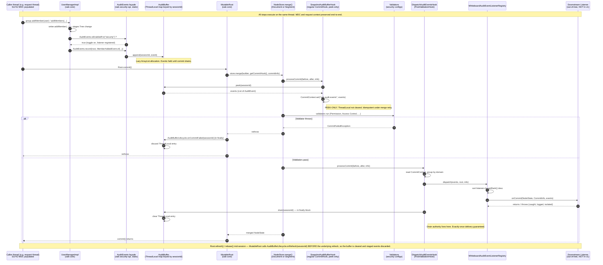
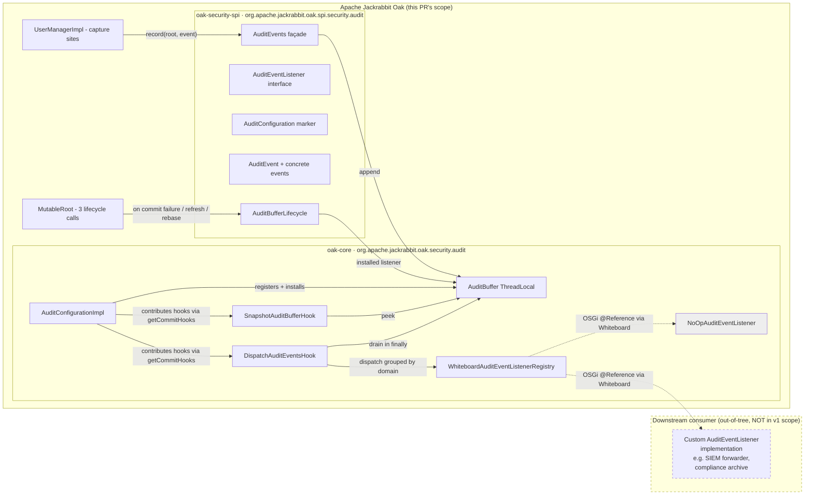

# Audit SPI — Scope and Flow Diagram

Companion to `99-final-plan.md`. Two questions answered here:

1. **What events does v1 cover, and what's missing** — fact-checked against the actual oak-security action SPIs and trunk source.
2. **End-to-end flow** — what runs where, in what thread, including how a downstream listener participates.

---

## 1. Flow diagram

### Where the listener lives

The downstream listener (`L` above) is **out-of-tree** in v1 — it lives in whatever bundle/module installs it via the Whiteboard:

The downstream listener interacts with Oak only through the public SPI in `oak-security-spi`:
- Implements `AuditEventListener` (declares its domain via `getDomain()`, optional rank via `getRank()`).
- Registered via the Whiteboard (`Whiteboard.register(AuditEventListener.class, instance, props)` in non-OSGi mode; OSGi `@Component(service = AuditEventListener.class)` in OSGi mode).
- Receives events synchronously on the merge thread; responsibility for non-blocking implementation is on the listener.

**Nothing in Oak itself is rebuilt or modified by the listener.** It is a pure downstream consumer.

---

## 2. What events v1 covers — fact-checked

### v1 ships these 4 event types (all in the `"security"` domain)

| Event class | Capture site | Source line |
|---|---|---|
| `MemberAddedEvent` | `UserManagerImpl.onGroupUpdate(Group, isRemove=false, Authorizable)` | `oak-core/.../security/user/UserManagerImpl.java:371` |
| `MemberRemovedEvent` | `UserManagerImpl.onGroupUpdate(Group, isRemove=true, Authorizable)` | same site, branch on `isRemove` |
| `MembersAddedBulkEvent` | `UserManagerImpl.onGroupUpdate(Group, isRemove=false, isContentId, memberIds, failedIds)` | `oak-core/.../security/user/UserManagerImpl.java:393` |
| `MembersRemovedBulkEvent` | `UserManagerImpl.onGroupUpdate(Group, isRemove=true, isContentId, memberIds, failedIds)` | same site, branch on `isRemove` |

All four are captured from `UserManagerImpl.onGroupUpdate` (two overloads). All four extend `SecurityAuditEvent`. Domain constant: `SecurityAuditDomain.NAME = "security"` per `oak-security-spi__SecurityAuditDomain.java`.

### What this means concretely

v1 covers exactly one user-management operation type: **group membership add/remove**. Single-member and bulk variants both captured.

### What is NOT in v1 — captured-but-deferred events

Oak's security model already defines a complete callback taxonomy via its existing `AuthorizableAction` / `UserAction` / `GroupAction` SPIs in `oak-security-spi/src/main/java/org/apache/jackrabbit/oak/spi/security/user/action/`. Every callback below is **a natural capture site** that the v1 pipeline supports mechanically — instrumentation is just "add an `if (AuditEvents.isEnabledFor(...)) AuditEvents.record(root, NewEvent.of(...))` call." The events themselves need to be added to `oak-security-spi/.../audit/`.

#### User lifecycle (`AuthorizableAction`)

| Existing Oak callback | What v1.1 would add | Source line (oak-security-spi) |
|---|---|---|
| `onCreate(Group, Root, NamePathMapper)` | `GroupCreatedEvent` | `AuthorizableAction.java:77` |
| `onCreate(User, password, Root, NamePathMapper)` | `UserCreatedEvent` (omit password from payload) | `AuthorizableAction.java:92` |
| `onCreate(User systemUser, Root, NamePathMapper)` | `SystemUserCreatedEvent` | `AuthorizableAction.java:106` |
| `onRemove(Authorizable, Root, NamePathMapper)` | `AuthorizableRemovedEvent` (covers user and group) | `AuthorizableAction.java:122` |
| `onPasswordChange(User, newPassword, Root, NamePathMapper)` | `PasswordChangedEvent` (NEVER include `newPassword` in payload) | `AuthorizableAction.java:136` |

#### User-specific actions (`UserAction`)

| Existing Oak callback | What v1.1 would add | Source line |
|---|---|---|
| `onDisable(User, disableReason, Root, NamePathMapper)` | `UserDisabledEvent` / `UserEnabledEvent` (branch on `disableReason == null`) | `UserAction.java:54` |
| `onGrantImpersonation(User, Principal, Root, NamePathMapper)` | `ImpersonationGrantedEvent` | `UserAction.java:66` |
| `onRevokeImpersonation(User, Principal, Root, NamePathMapper)` | `ImpersonationRevokedEvent` | `UserAction.java:78` |

#### Access Control (no preexisting "action" SPI — capture at `AccessControlManagerImpl` directly)

| API entry point | What v1.1 would add | Source line (oak-core) |
|---|---|---|
| `AccessControlManagerImpl.setPolicy(absPath, policy)` | `AccessControlPolicySetEvent` (covers create/modify since JCR replaces atomically; `policy` payload identifies ACL vs principal-based) | `oak-core/.../security/authorization/accesscontrol/AccessControlManagerImpl.java:205` |
| `AccessControlManagerImpl.removePolicy(absPath, policy)` | `AccessControlPolicyRemovedEvent` | `AccessControlManagerImpl.java:311` |
| `AccessControlManagerImpl$AbstractAccessControlList.orderBefore(srcEntry, destEntry)` | `AccessControlEntryReorderedEvent` | `AccessControlManagerImpl.java:769` |
| ACE add/remove (via `JackrabbitAccessControlPolicy.addAccessControlEntry(...)` / `removeAccessControlEntry(...)`) | Captured via `setPolicy` since JCR composes ACE changes into a policy update | (same module) |

#### Tokens (no preexisting "action" SPI — capture at `TokenProviderImpl` directly)

| API entry point | What v1.1 would add | Source line (oak-core) |
|---|---|---|
| `TokenProviderImpl.createToken(Credentials)` | `TokenCreatedEvent` (NEVER include token value in payload — only token-node identifier) | `oak-core/.../security/authentication/token/TokenProviderImpl.java:178` |
| `TokenProviderImpl.createToken(userId, attrs)` | same | `TokenProviderImpl.java:211` |
| `TokenInfo.remove()` | `TokenRevokedEvent` | `TokenInfo` interface in `oak-security-spi` |
| `TokenInfo.resetExpiration(...)` | `TokenRefreshedEvent` | same |

#### CUG (no preexisting "action" SPI — capture at `CugAccessControlManager` directly)

| API entry point | What v1.1 would add | Source line (oak-authorization-cug) |
|---|---|---|
| `CugAccessControlManager.setPolicy(absPath, policy)` | `CugPolicySetEvent` | `oak-authorization-cug/.../impl/CugAccessControlManager.java:183` |
| `CugAccessControlManager.removePolicy(absPath, policy)` | `CugPolicyRemovedEvent` | `CugAccessControlManager.java:158` |

#### External authentication (oak-auth-external)

| API entry point | What v1.1 would add | Source line |
|---|---|---|
| `DefaultSyncContext.syncExternalIdentity(...)` | `ExternalIdentitySyncedEvent` | `oak-auth-external/.../basic/DefaultSyncContext.java:492` |
| `DefaultSyncContext.syncMembership(...)` | covered by existing `MembersAdded/RemovedBulkEvent` if instrumented from the underlying `UserManagerImpl` calls | `DefaultSyncContext.java:508` |
| `DefaultSyncContext.syncProperties(...)` | `ExternalIdentityPropertiesSyncedEvent` | `DefaultSyncContext.java:646` |
| `ExternalIdentityMonitor.syncFailed(...)` | not auditable in v1 model — no `Root.commit()`; would need a parallel non-commit channel | `oak-auth-external/.../monitor/ExternalIdentityMonitor.java:54` |

#### Privileges

| API entry point | What v1.1 would add | Source line |
|---|---|---|
| `PrivilegeManagerImpl.registerPrivilege(...)` | `PrivilegeRegisteredEvent` | `oak-core/.../security/privilege/PrivilegeManagerImpl.java` |

---

### What is structurally NOT auditable in this design (any version)

Per alex's source validation (`02-oak-validation.md` §6 and §9):

1. **`OakInitializer.initialize(...)`-path mutations** — repository initialization, workspace initialization. The init hook chain is built in `Oak.initialContent()` (`oak-core/.../Oak.java:693-714`) and **does not include** `securityProvider.getConfigurations()`-contributed hooks. Even if a capture site somewhere ran during init, the dispatch hooks aren't in the chain. Init-time mutations are invisible to audit. Only relevant in practice for: first-boot user/group seeding, workspace creation, in-place upgrade migrations.

2. **Internal `NodeStore.merge(...)` paths bypassing `MutableRoot`** — async indexing (`AsyncIndexUpdate`), segment compaction, MongoDB GC, journal pruning. These call `NodeStore.merge` directly with their own hook chains. No security audit dispatch.

3. **Login / logout events** — authentication does not go through `Root.commit()`. A `LoginContext.login()` succeeds or fails outside the commit path. The current Oak design provides `LoginModuleMonitor` (a metrics-style observer) at `oak-security-spi/.../authentication/LoginModuleMonitor.java` but no commit-attached audit signal. Capturing authentication events would require **a separate, non-commit-attached audit channel** — out of scope for this design.

4. **Read access** — "user X read node Y" never enters a commit. JCR reads short-circuit at the `PermissionProvider` evaluator without producing a commit boundary. Out of scope.

5. **Denied access** — a permission check that fails throws `AccessDeniedException` without invoking `Root.commit()`. Same constraint as #3 and #4. Out of scope.

6. **Pure-read query execution** — same.

---

### Side-by-side summary

| Category | In v1 | Captured in v1.1+ | Structurally unauditable |
|---|---|---|---|
| Group member added/removed (single + bulk) | ✅ 4 event types | — | — |
| User/group created/removed/disabled | — | ✅ 5 events (UserCreated, GroupCreated, SystemUserCreated, AuthorizableRemoved, UserDisabled/Enabled) | — |
| Password changed | — | ✅ `PasswordChangedEvent` (without password value) | — |
| Impersonation granted/revoked | — | ✅ 2 events | — |
| ACL policy set/removed/ACE reordered | — | ✅ 3 events (via `AccessControlManagerImpl`) | — |
| Token created/revoked/refreshed | — | ✅ 3 events (via `TokenProviderImpl`) | — |
| CUG policy set/removed | — | ✅ 2 events (via `CugAccessControlManager`) | — |
| External-identity sync (user/membership/properties) | — | ✅ 2–3 events; sync-failure NOT (no commit) | partial |
| Privilege registration | — | ✅ 1 event | — |
| Login / logout | — | — | ❌ no commit boundary |
| Denied access / read access | — | — | ❌ no commit boundary |
| Repository initialization mutations | — | — | ❌ init hook chain bypasses security configs |
| Async index / GC / compaction mutations | — | — | ❌ bypass `MutableRoot` |

**Bottom line:** v1 ships a working pipeline that audits **1 of ~17 capturable security-domain operation categories** (4 of ~17 event types if counting variants). The mechanism for everything in the middle column is identical to v1 — add an event class to `oak-security-spi/.../audit/`, add an `if (AuditEvents.isEnabledFor(...)) AuditEvents.record(...)` call at the corresponding API entry point. The right column requires a different design (non-commit-attached audit channel) and is out of scope for this work.
