# Design v3 — Observer-based audit drain

**Status:** READY FOR FREEZE (shannon #10, sage #12, alex #13, team-lead — all converged; final consistency pass applied)
**Author:** ada
**Supersedes:** `design.md` §5 + §6 (commit-attached pipeline, the v2 hook-based dispatch path). All other v2 design (event primitives, fire-and-forget pipeline, `AuditEvents` façade, capture sites, `SecurityAuditEvents` helper, `AuditEventListener` SPI, trust model) is unchanged unless explicitly called out below.
**Audience:** grace (implementation), turing (tests + benchmarks), sage (security review), alex (Oak conventions sanity check), team-lead (orchestration).

**Shannon's findings integrated (task #10 result):**
- Observer.contentChanged is invoked SYNCHRONOUSLY on the merge thread for all four production NodeStore implementations (Memory, Segment, Document, Composite — all routed through `ChangeDispatcher`).
- `CommitInfo.getSessionId()` equals `ContentSession.toString()` (set at `MutableRoot.java:262`), matching the key the `AuditBuffer` uses.
- `CompositeObserver.contentChanged` (`oak-store-spi/.../spi/commit/CompositeObserver.java:46-53`) does NOT isolate per-observer exceptions — a throwing observer cascades to break the observer chain (including JCR's observation dispatcher). **The audit observer MUST defensively swallow Throwable at the observer level**, not just at the per-listener level. v3 design adds this outer catch.
- No ordering guarantee among observers. We don't depend on order.
- Every successful `NodeStore.merge` fires observers, including migration paths (their drain is no-op).
- `addObserver` fires a bootstrap `EMPTY_EXTERNAL` invocation on registration; the `isExternal()` short-circuit handles it.
- **Recommended wiring pattern:** the Lucene idiom in `oak-lucene/.../hybrid/LocalIndexObserver.java` + `LuceneIndexProviderService.java:617-618` — register the Observer as an OSGi service via `bundleContext.registerService(Observer.class.getName(), observer, null)`. Oak's `ObserverTracker` (in `oak-store-spi/.../spi/commit/ObserverTracker.java`, instantiated per NodeStoreService — e.g., `DocumentNodeStoreService.java:481`, `SegmentNodeStoreRegistrar.java:388`, `CompositeNodeStoreService.java:187`) picks up Observer services and registers them against the root NodeStore via `Observable.addObserver(...)`. v3 follows this idiom — **NOT** `@Reference Observable` (which my earlier draft mistakenly proposed).

---

## 0. Executive summary

v3 drops the two commit hooks (`SnapshotAuditBufferHook` + `DispatchAuditEventsHook`) and replaces them with a single `Observer` registered against the root NodeStore via `Observable.addObserver(...)`. The observer drains the `AuditBuffer` and dispatches to listeners on commit success — the same boundary the v2 `PostValidationHook` provided, but now reached through Oak's generic content-observation SPI instead of through `SecurityConfiguration.getCommitHooks(...)`.

The user's framing: **audit is genuinely independent of security**, and the v2 `AuditConfiguration extends SecurityConfiguration` mechanism that justified hook contribution was the last remaining security coupling. v3 cuts it. `AuditConfiguration` moves to `oak-audit-spi`, no longer extends `SecurityConfiguration`, and is wired through Whiteboard / OSGi reference instead of through `SecurityProvider.getConfiguration(...)`.

What does NOT change:
- Event primitives in `oak-audit-spi` (`AuditEvent`, `AuditEventListener`, `AuditEventEmitter`, `AuditEvents` façade, `AuditBufferLifecycle`).
- Per-listener exception isolation (Throwable catch, WARN log).
- `CommitMetadataDecorator` — invoked from the observer instead of the dispatch hook, but its body and contract are byte-identical.
- The fire-and-forget pipeline (`AuditEventEmitter.emit`).
- `MutableRoot` lifecycle callouts at lines 238/249/270 (`onRefresh` × 2, `onCommitFailed` × 1) — these handle paths the observer doesn't see (refresh, rebase, commit-fail before merge succeeds).
- The 100% line / 100% branch coverage gate on `oak-audit-spi`. The `oak-security-spi` 100% gate is unaffected (we're REMOVING content from `oak-security-spi`, not adding).

What DOES change:
- `AuditConfiguration` interface: moves to `oak-audit-spi`, drops `extends SecurityConfiguration`.
- `AuditConfigurationImpl`: stops contributing commit hooks; gains a `ServiceRegistration<?>` field for the Observer service registration. OSGi `@Activate` publishes the singleton drain observer via `bundleContext.registerService(Observer.class.getName(), getDrainObserver(), null)`; the per-NodeStoreService `ObserverTracker` then auto-attaches it. **No `@Reference Observable` / `@Reference NodeStore` on `AuditConfigurationImpl`** — see §5.1.
- The two commit hooks (`SnapshotAuditBufferHook`, `DispatchAuditEventsHook`) are DELETED. Replaced by one `AuditDrainObserver`.
- `SnapshotAuditBufferHook.COMMIT_CONTEXT_KEY` stash mechanism: gone (no longer needed — the observer drains the buffer directly).
- `SecurityProviderBuilder.withAuditConfiguration(...)`: deleted; non-OSGi wiring goes through `AuditConfigurationImpl.initialize(Whiteboard)` plus an explicit `((Observable) store).addObserver(audit.getDrainObserver())` call from the embedder, holding the returned `Closeable` for tear-down (see §6).
- The `InternalSecurityProvider.auditConfiguration` field + `SecurityProviderRegistration.bindAuditConfiguration` path: deleted (audit no longer participates in `SecurityProvider.getConfigurations()`).

---

## 1. The fundamental shift

### v2 (current `trunk`)

```
MutableRoot.commit()
  → store.merge(builder, getCommitHook(), commitInfo)         [thread T1]
      → ResetCommitAttributeHook
      → SecurityConfiguration hooks (regular)
          └─ SnapshotAuditBufferHook                            [stashes buffer → CommitContext]
      → EditorHook(validators)                                  [validation]
      → SecurityConfiguration hooks (PostValidationHook)
          └─ DispatchAuditEventsHook                            [drains buffer, decorates, dispatches to listeners]
      → durable commit
  → returns to MutableRoot
```

### v3

```
MutableRoot.commit()
  → store.merge(builder, getCommitHook(), commitInfo)         [thread T1]
      → ResetCommitAttributeHook
      → SecurityConfiguration hooks (regular)
          └─ NONE for audit                                     [hooks deleted]
      → EditorHook(validators)
      → SecurityConfiguration hooks (PostValidationHook)
          └─ NONE for audit                                     [hooks deleted]
      → durable commit
      → ChangeDispatcher.contentChanged(rootAfter, commitInfo)  [synchronous, same thread T1]
          └─ AuditDrainObserver.contentChanged(root, info)      [drains buffer, decorates, dispatches]
  → returns to MutableRoot
```

The observer fires synchronously on the same thread as the commit, AFTER durable persistence, BEFORE `store.merge` returns. The threading invariant — single-threaded session, ThreadLocal buffer keyed by session id — is preserved.

> **Confirmed by shannon (task #10):** `Observer.contentChanged(...)` IS invoked synchronously on the commit thread for all four production NodeStore implementations (Memory, Segment, Document, Composite — all funnel through `ChangeDispatcher`). The buffer's ThreadLocal semantics survive v3 without modification.

---

## 2. Architecture overview

```mermaid
flowchart LR
    subgraph PROD["Producers"]
        OAK_CAP["Oak internal capture<br>(UserManagerImpl etc.)"]
        AEM_CAP["AEM / Sling / 3rd-party<br>any bundle, any time"]
    end

    subgraph FACADE["oak-audit-spi · AuditEvents (static)"]
        REC["record(root, event)"]
        DISP["dispatch(event)"]
    end

    subgraph PATH_CA["Commit-attached path (oak-core, v3)"]
        BUF["ThreadLocal AuditBuffer"]
        VAL["Validators"]
        DURABLE["Durable commit"]
        OBS["AuditDrainObserver<br>(decorate payload + drain)"]
    end

    EMIT["AuditEventEmitterImpl<br>(oak-core, OSGi @Component)"]

    REG["WhiteboardAuditEventListenerRegistry"]

    subgraph LISTENERS["Listeners (consumer bundles)"]
        L1["SiemForwarder<br>onEvents(events)"]
        L2["ComplianceArchive<br>onEvents(events)"]
    end

    OAK_CAP --> REC
    REC --> BUF
    BUF --> VAL
    VAL -->|merge ok| DURABLE
    DURABLE -->|ChangeDispatcher.contentChanged| OBS
    OBS --> REG

    AEM_CAP -->|"@Reference emit"| EMIT
    EMIT --> DISP
    DISP --> REG

    REG -->|filter by domain<br>sort by rank| L1
    REG --> L2

    style PROD fill:#fff4e0
    style EMIT fill:#e0ffe0
    style LISTENERS fill:#f0e0ff
    style OBS fill:#e0e0ff
```



The diagram differs from v2 (`design.md` §2) only in the commit-attached path: `VAL → DRAIN` becomes `VAL → DURABLE → OBS`. Everything else — façade, registry, fire-and-forget — is identical.

---

## 3. SPI layout — v3

### 3.1 `oak-audit-spi` — gains `AuditConfiguration`

`AuditConfiguration` MOVES from `oak-security-spi/.../spi/security/audit/` to `oak-audit-spi/.../spi/audit/`. New package: `org.apache.jackrabbit.oak.spi.audit`. New file: `oak-audit-spi/src/main/java/org/apache/jackrabbit/oak/spi/audit/AuditConfiguration.java`.

```java
package org.apache.jackrabbit.oak.spi.audit;

import org.jetbrains.annotations.NotNull;
import org.osgi.annotation.versioning.ProviderType;

/**
 * Audit pipeline configuration handle. Exposes pipeline-level state
 * ({@link #isActive()}) so admin tooling, monitoring agents, and other
 * Oak components can probe the pipeline without depending on its
 * implementation class.
 *
 * <p><strong>Wiring.</strong> Audit is a top-level Oak concern in v3 —
 * <em>not</em> a {@code SecurityConfiguration}. Implementations are
 * registered on the {@link org.apache.jackrabbit.oak.spi.whiteboard.Whiteboard}
 * (and, in OSGi deployments, as an OSGi service of this type). The pipeline
 * subscribes to the root NodeStore's {@link org.apache.jackrabbit.oak.spi.commit.Observable}
 * for commit notifications; commit hook contribution is no longer used.
 *
 * <p><strong>Cardinality:</strong> unary optional. Multiple implementations
 * are not supported — the {@link AuditBufferLifecycle} is a singleton install
 * and multiple observers on the same root NodeStore would each produce a
 * duplicate dispatch. Multiplexing belongs at the listener layer
 * ({@link AuditEventListener}), not at the configuration layer.
 *
 * <p>When no implementation is bound, callers either see no service
 * (Whiteboard / OSGi lookups return empty) or the {@link #NOOP} constant
 * if they want a guaranteed-non-null handle. {@code NOOP.isActive()}
 * returns {@code false}.
 */
@ProviderType
public interface AuditConfiguration {

    /**
     * Name of the audit configuration. Stable across releases. Retained
     * from the v2 SPI surface to keep identity for tooling that may have
     * coded against the constant.
     */
    String NAME = "org.apache.jackrabbit.oak.audit";

    /**
     * Returns {@code true} when the audit pipeline is currently active —
     * i.e., the audit feature toggle is enabled AND at least one
     * {@code AuditEventListener} is registered on the Whiteboard. The
     * two predicates AND together so a deployed-but-unused pipeline still
     * reports {@code false}, matching the no-allocation semantics
     * documented at {@link AuditEvents#isEnabled()}.
     *
     * <p>Equivalent in semantics to {@code AuditEvents.isEnabled()}, but
     * reachable via the typed handle. Drift-prevention: both paths read
     * through the volatile {@code AuditEvents.sink} (single source of
     * truth). Any future divergence MUST be documented explicitly in
     * both Javadocs.
     */
    boolean isActive();

    /**
     * NOOP default. Reports {@link #isActive()} as {@code false}.
     */
    AuditConfiguration NOOP = new Noop();

    /**
     * NOOP implementation. Package-private by design — consumers refer
     * to the {@link #NOOP} constant.
     */
    final class Noop implements AuditConfiguration {

        @Override
        public boolean isActive() {
            return false;
        }
    }
}
```

**Key shape changes vs the v2 interface in `oak-security-spi`:**
- Package changes: `org.apache.jackrabbit.oak.spi.security.audit` → `org.apache.jackrabbit.oak.spi.audit`.
- `extends SecurityConfiguration` is removed.
- `getCommitHooks(String)` is no longer inherited — there is no commit-hook contribution.
- `Noop` no longer extends `SecurityConfiguration.Default` — it's now a bare implementation.
- `NAME` constant is preserved (consumers may have coded against it for identity).
- `FEATURE_TOGGLE_NAME` constant continues to stay on `AuditConfigurationImpl` — same rationale as v2 §3.2a (no upstream OAK ticket yet, SPI stickiness asymmetry).

### 3.2 `oak-security-spi` — `AuditConfiguration` is DELETED

The current file `oak-security-spi/src/main/java/org/apache/jackrabbit/oak/spi/security/audit/AuditConfiguration.java` is deleted. The accompanying test `AuditConfigurationTest.java` is deleted.

The peer files in the same package stay where they are (`SecurityAuditDomain`, `package-info.java`) — these are security-DOMAIN constants; they remain a legitimate part of `oak-security-spi` because they describe events whose meaning IS security-related, even though the pipeline carrying them is now domain-neutral.

**Post-freeze cleanup (commit `b1960e81a4`):** further consolidation happened after design freeze. `SecurityAuditEvents` was deleted; its producer-side helpers moved into a package-private `UserAuditEvents` in `oak-core/.../security/user/`, co-located with the capture site (`UserManagerImpl`). `SecurityAuditTypes` was renamed to `UserAuditTypes` and moved alongside the user SPI at `oak-security-spi/.../spi/security/user/`. `SecurityAuditDomain.NAME` changed value from `"security"` to `"oak.security"` to namespace the domain. The Module Layout table in `oak-doc/src/site/markdown/security/audit.md` reflects the post-cleanup shape and is the canonical reference for the current package layout.

Consumers that imported `org.apache.jackrabbit.oak.spi.security.audit.AuditConfiguration` MUST switch to `org.apache.jackrabbit.oak.spi.audit.AuditConfiguration`. On the fork this is a one-shot rename — we control all callers. On upstreaming, the path is additive-then-removed (add the new interface in a release; mark the old one `@Deprecated` for one release; remove). Alex's input on the deprecation cadence is solicited.

### 3.3 Package-info versions

**`oak-audit-spi/.../spi/audit/package-info.java`** — bump from `@Version("1.0.0")` to `@Version("1.1.0")`. Per team-lead's call: adding the `AuditConfiguration` interface is textbook binary-additive (every existing consumer that imported `AuditEvent`, `AuditEventListener`, `AuditEvents`, `AuditEventEmitter`, `AuditBufferLifecycle`, `AuditEventAware` continues to work unchanged; the new interface is opt-in). OSGi version semantics measure binary compatibility, not human notions of "package enlargement". `1.1.0` is the correct minor bump; `2.0.0` would falsely signal a breaking change to bnd baseline-check tooling and downstream consumers.

**`oak-security-spi/.../spi/security/audit/package-info.java`** — MAJOR bump required because `AuditConfiguration` is REMOVED from this package (it moves to `oak-audit-spi`). The bnd baseline check will flag the removal otherwise. Whatever the current `@Version` of the security-audit subpackage is (likely `1.0.0` or `1.1.0`), increment the major component. Post-freeze cleanup (see §3.2): the package was further trimmed — only `SecurityAuditDomain` and `package-info.java` remain in `spi/security/audit/`; `SecurityAuditTypes` moved to `spi/security/user/` (as `UserAuditTypes`) and `SecurityAuditEvents` was deleted (helpers moved to a package-private `UserAuditEvents` in `oak-core/.../security/user/`). MAJOR bump is still the correct call for both packages because of the `AuditConfiguration` removal plus the relocations.

---

## 4. Implementation — v3

### 4.1 `AuditDrainObserver` — new class

Lives at `oak-core/src/main/java/org/apache/jackrabbit/oak/security/audit/AuditDrainObserver.java`. Package question (kept in `security.audit` for minimum churn, or moved to a neutral `oak.audit`) is **open for team-lead decision** — see §13 below.

```java
package org.apache.jackrabbit.oak.security.audit;

import java.util.ArrayList;
import java.util.HashMap;
import java.util.List;
import java.util.Map;

import org.apache.jackrabbit.oak.spi.audit.AuditEvent;
import org.apache.jackrabbit.oak.spi.audit.AuditEventListener;
import org.apache.jackrabbit.oak.spi.commit.CommitInfo;
import org.apache.jackrabbit.oak.spi.commit.Observer;
import org.apache.jackrabbit.oak.spi.state.NodeState;
import org.apache.jackrabbit.oak.spi.toggle.Feature;
import org.jetbrains.annotations.NotNull;
import org.slf4j.Logger;
import org.slf4j.LoggerFactory;

/**
 * {@link Observer} that drains the {@link AuditBuffer} on commit success
 * and dispatches captured events to all registered {@link AuditEventListener}s.
 * <p>
 * Replaces the v2 {@code SnapshotAuditBufferHook} + {@code DispatchAuditEventsHook}
 * pair. The observer fires synchronously on the same thread as the
 * surrounding {@code MutableRoot.commit()} — by the contract of
 * {@link org.apache.jackrabbit.oak.spi.commit.Observable#addObserver}
 * the call is made from the commit dispatch path, before
 * {@code NodeStore.merge(...)} returns. This preserves the
 * {@code ThreadLocal} semantics that the {@link AuditBuffer} relies on.
 * <p>
 * <strong>External changes are ignored.</strong> When
 * {@link CommitInfo#isExternal()} returns {@code true} (cluster sync from
 * a peer node, or the initial replay invocation at {@code addObserver()}
 * time with {@link CommitInfo#EMPTY_EXTERNAL}), the observer returns
 * immediately. External commits did not originate any local
 * {@code AuditEvents.record(...)} calls, so there is nothing in the
 * per-session buffer to drain. Explicit short-circuit; cleaner than
 * relying on the buffer to return empty.
 * <p>
 * <strong>Two-layer exception isolation:</strong>
 * <ul>
 *   <li><strong>Outer barrier</strong> wraps the ENTIRE method body. The
 *   Observer chain has no per-observer isolation
 *   ({@code CompositeObserver.java:46-53} — bare {@code for} loop with no
 *   try/catch). Any throw out of this method propagates through
 *   {@code DocumentNodeStore.java:1140-1144} (in a {@code finally} after
 *   {@code setRoot}) or {@code LockBasedScheduler.java:303} (after
 *   {@code head.set}), surfacing as a {@code RuntimeException} to the
 *   merge caller despite a successful durable commit. Worse, on
 *   DocumentNodeStore the inner catch at {@code DocumentNodeStore:1130-1139}
 *   suppresses in-memory commit-apply failures, so an audit-induced throw
 *   would mask a different kind of failure entirely. The outer Throwable
 *   barrier guarantees audit never masquerades as a commit failure.</li>
 *   <li><strong>Inner barrier</strong> per listener (in {@code dispatchOne}).
 *   Preserves the v2 invariant: a misconfigured consumer bundle whose
 *   listener throws {@link LinkageError}, {@link OutOfMemoryError}, or
 *   other {@link Throwable} subtypes does not stop other listeners.</li>
 * </ul>
 *
 * <p><strong>DO NOT wrap this Observer in {@code BackgroundObserver}.</strong>
 * The async wrapper drops the {@code CommitInfo.sessionId} on queue overflow
 * (it replaces the latest queued entry with
 * {@code new ContentChange(root, CommitInfo.EMPTY_EXTERNAL)} —
 * {@code BackgroundObserver.java:283-286}). The audit drain keys exclusively
 * on {@code info.getSessionId()} to look up the per-thread buffer;
 * losing session id on overflow → silent audit-event loss for
 * high-rate writers. Synchronous dispatch is mandatory. See §9 invariant I4.
 */
final class AuditDrainObserver implements Observer {

    private static final Logger log = LoggerFactory.getLogger(AuditDrainObserver.class);

    private final Feature featureToggle;
    private final AuditBuffer buffer;
    private final WhiteboardAuditEventListenerRegistry registry;

    AuditDrainObserver(@NotNull Feature featureToggle,
                       @NotNull AuditBuffer buffer,
                       @NotNull WhiteboardAuditEventListenerRegistry registry) {
        this.featureToggle = featureToggle;
        this.buffer = buffer;
        this.registry = registry;
    }

    @Override
    public void contentChanged(@NotNull NodeState root, @NotNull CommitInfo info) {
        // OUTER Throwable barrier. CompositeObserver
        // (oak-store-spi/.../spi/commit/CompositeObserver.java:46-53) does NOT
        // isolate per-observer exceptions: a Throwable from this method
        // cascades through the observer chain and would break peer observers
        // such as JCR's observation dispatcher. We swallow defensively so the
        // audit pipeline can never destabilise unrelated observer work. The
        // per-listener barrier inside dispatchOne catches listener-induced
        // failures; this outer catch protects against drain/decorator bugs.
        try {
            doContentChanged(info);
        } catch (Throwable t) {
            log.warn("AuditDrainObserver: unexpected error during drain/dispatch (session {}); " +
                    "swallowing to preserve observer-chain isolation.",
                    info.getSessionId(), t);
        }
    }

    private void doContentChanged(@NotNull CommitInfo info) {
        // External commits never produce local audit events (capture sites
        // are local-only by construction). The bootstrap invocation at
        // addObserver-time with CommitInfo.EMPTY_EXTERNAL also lands here.
        if (info.isExternal()) {
            return;
        }
        if (!featureToggle.isEnabled()) {
            return;
        }
        String sessionId = info.getSessionId();
        // The buffer is per-thread; this drain runs on the same thread that
        // called Root.commit() (synchronous Observer contract via
        // ChangeDispatcher for local commits). The sessionId returned by
        // CommitInfo equals ContentSession.toString() — set at
        // MutableRoot.java:262 — so it matches the buffer's keying.
        List<AuditEvent> events = buffer.drain(sessionId);
        if (events == null || events.isEmpty()) {
            return;
        }
        List<AuditEventListener> listeners = registry.getListeners();
        if (listeners.isEmpty()) {
            return;
        }
        List<AuditEvent> decorated = CommitMetadataDecorator.decorate(events, info);
        Map<String, List<AuditEvent>> byDomain = groupByDomain(decorated);
        for (AuditEventListener listener : listeners) {
            List<AuditEvent> forListener = byDomain.get(listener.getDomain());
            if (forListener == null || forListener.isEmpty()) {
                continue;
            }
            dispatchOne(listener, forListener);
        }
    }

    private static @NotNull Map<String, List<AuditEvent>> groupByDomain(@NotNull List<AuditEvent> events) {
        Map<String, List<AuditEvent>> byDomain = new HashMap<>(4);
        for (AuditEvent event : events) {
            byDomain.computeIfAbsent(event.getDomain(), k -> new ArrayList<>(events.size())).add(event);
        }
        return byDomain;
    }

    private static void dispatchOne(@NotNull AuditEventListener listener,
                                    @NotNull List<AuditEvent> events) {
        try {
            listener.onEvents(events);
        } catch (Throwable t) {
            // Per-listener isolation: a misconfigured consumer bundle whose listener
            // throws e.g. LinkageError must not crash the commit-dispatch path for
            // unrelated work. JVM-level pathology (OutOfMemoryError) is caught here
            // too but re-triggers on the next allocation and surfaces through normal
            // channels. Do not narrow this catch to RuntimeException without
            // re-reading the design discussion. See: design-v3-observer-drain.md §0.
            log.warn("AuditEventListener {} threw {} for {} event(s) in domain '{}'; isolating from other listeners.",
                    listener.getClass().getName(), t.getClass().getSimpleName(),
                    events.size(), listener.getDomain(), t);
        }
    }
}
```

**Notable choices:**

- **No `CommitContext` involvement.** Unlike v2's two-hook design (Snapshot stashes into CommitContext, Dispatch reads from it), v3 drains the buffer directly. The `CommitContext` exfiltration concern called out at `SnapshotAuditBufferHook.java:60-68` is gone — events never enter CommitContext.
- **Same Throwable catch as v2.** Byte-for-byte parity with `DispatchAuditEventsHook.dispatchOne` and `BufferSink.dispatch`. Sage's invariant #1 in the pre-warm.
- **Same decorator call.** `CommitMetadataDecorator.decorate(events, info)` is invoked here; the decorator class body is unchanged. Sage's invariant #2 preserved.
- **No `throws CommitFailedException`.** Observer's contract is `void contentChanged(NodeState, CommitInfo)` — no checked exceptions. Listener exceptions are swallowed via the per-listener Throwable catch (inner barrier); drain/decorator bugs are swallowed via the outer barrier in `contentChanged`. Both barriers exist because `CompositeObserver` does not isolate observers (shannon confirmed). We never throw.

- **No `@Component` on AuditDrainObserver.** This class is a plain Java type, instantiated and registered by `AuditConfigurationImpl` (see §5.2). The OSGi-visible service is registered via `BundleContext.registerService(Observer.class.getName(), ...)`, matching the Lucene `LocalIndexObserver` idiom (`LuceneIndexProviderService.java:617-618`). Oak's `ObserverTracker` (in `oak-store-spi/.../spi/commit/ObserverTracker.java`, instantiated per NodeStoreService — `DocumentNodeStoreService.java:481`, `SegmentNodeStoreRegistrar.java:388`, `CompositeNodeStoreService.java:187`) picks up the `Observer` service and subscribes it to the root NodeStore.

### 4.2 `AuditConfigurationImpl` — restructured

Lives at the same path: `oak-core/src/main/java/org/apache/jackrabbit/oak/security/audit/AuditConfigurationImpl.java`. Diff from v2:

1. Drop `extends ConfigurationBase`.
2. Drop `implements SecurityConfiguration` indirectly (the parent class brought it in).
3. Drop the `@Component(service = {AuditConfiguration.class, SecurityConfiguration.class})` — change to `@Component(service = AuditConfiguration.class)`.
4. **Do NOT add `@Reference Observable observable;`** (this was a misstep in the earlier draft). Instead, follow Oak's existing Observer-registration idiom (`LuceneIndexProviderService.java:617-618`): the OSGi `@Activate` registers the observer as an `Observer` service on the `BundleContext`, and Oak's `ObserverTracker` (instantiated per NodeStoreService — `DocumentNodeStoreService.java:481`, `SegmentNodeStoreRegistrar.java:388`, `CompositeNodeStoreService.java:187`) picks it up and subscribes it to the root NodeStore.
5. Add `private ServiceRegistration<?> observerRegistration;` field — holds the OSGi service registration so `@Deactivate` can unregister.
6. Drop `getCommitHooks(String)` — gone.
7. `BufferSink` (inner class) — UNCHANGED. It's the `Sink` for `AuditEvents` and still backs the capture-time enqueue path.

8. **OSGi `@Activate` (the new shape):**

```java
@Activate
private void activate(@NotNull Configuration configuration,
                      @NotNull BundleContext bundleContext,
                      @NotNull Map<String, Object> properties) {
    setParameters(ConfigurationParameters.of(properties));   // if we still extend something that needs it; else remove
    Whiteboard whiteboard = new OsgiWhiteboard(bundleContext);
    initialize(whiteboard);
    // After initialize() the buffer + registry + toggle + sink + drainObserver are
    // all live. Register the observer service LAST so any commit thread that races
    // with activation either misses the observer entirely (no harm — events stay
    // buffered for next commit) or sees a fully-wired pipeline.
    observerRegistration = bundleContext.registerService(
            Observer.class.getName(), getDrainObserver(), null);
}
```

9. **Embedded (non-OSGi) `initialize(...)`:** signature UNCHANGED from v2 — `initialize(Whiteboard)`. The drain observer is constructed ONCE inside `initialize(...)`, cached as a field, and exposed via a getter (singleton). Per alex/grace's amendment — `getDrainObserver()` factory would have been a foot-gun because the ThreadLocal lives on `AuditBuffer`, not on the Observer; two Observer instances sharing the same buffer would create double-dispatch under any non-destructive drain refactor.

```java
// Field — alongside featureToggle / buffer / registry
private AuditDrainObserver drainObserver;

public void initialize(@NotNull Whiteboard whiteboard) {
    featureToggle = Feature.newFeature(FEATURE_TOGGLE_NAME, whiteboard);

    registry = new WhiteboardAuditEventListenerRegistry();
    registry.start(whiteboard);

    buffer = new AuditBuffer();
    AuditBufferLifecycle.install(buffer);

    AuditEvents.install(new BufferSink(featureToggle, registry, buffer));

    // Construct ONCE. Cached for re-use by both OSGi @Activate (which
    // publishes it as an Observer service) and embedded callers (which
    // pass it to Oak.with(Observer)).
    drainObserver = new AuditDrainObserver(featureToggle, buffer, registry);

    log.info("Audit pipeline activated. Toggle '{}' = {}.",
            FEATURE_TOGGLE_NAME, featureToggle.isEnabled());
}

/**
 * Returns the singleton {@link Observer} for this pipeline. Embedded
 * callers attach it to the root NodeStore explicitly via
 * {@code ((Observable) store).addObserver(audit.getDrainObserver())} and
 * hold the returned {@link Closeable} for tear-down. The
 * {@code Oak.with(Observer)} auto-attach path at {@code Oak.java:300-302}
 * only fires for Oak's DEFAULT whiteboard; embedded test setups that share
 * a Whiteboard between audit and Oak (the common case) replace that default
 * via {@code Oak.with(Whiteboard)} and lose the auto-attach. See §6 of the
 * v3 design doc for the full embedded pattern.
 *
 * <p><strong>Singleton by design.</strong> The drain Observer is constructed
 * once in {@link #initialize(Whiteboard)} and reused; multi-attach
 * (two Observer instances against the same root NodeStore) would create
 * race-prone double-dispatch under any future drain refactor that drops the
 * destructive-by-default semantic. Mirrors how {@link BufferSink} is
 * installed once into {@link AuditEvents}.
 *
 * @throws IllegalStateException if called before {@link #initialize(Whiteboard)}
 *                               or after {@link #dispose()}.
 */
public @NotNull Observer getDrainObserver() {
    if (drainObserver == null) {
        throw new IllegalStateException(
                "AuditConfigurationImpl.initialize(...) must be called first");
    }
    return drainObserver;
}
```

The `getDrainObserver()` method exposes the singleton. OSGi `@Activate` passes it to `bundleContext.registerService(Observer.class.getName(), getDrainObserver(), null)` — `ObserverTracker` (per NodeStoreService) then auto-attaches it to the root NodeStore. Embedded callers attach explicitly via `((Observable) store).addObserver(getDrainObserver())` because Oak's `Oak.with(Observer)` auto-attach is bypassed once `Oak.with(Whiteboard)` replaces the default whiteboard (see §6). Both paths converge at the same `Observable.addObserver(...)` call against the same Observer instance.

10. **OSGi `@Deactivate`:**

```java
@Deactivate
private void deactivate() {
    // Unregister the observer service FIRST. ObserverTracker, on noticing the
    // service disappear, closes its subscription on the root NodeStore — so
    // no further contentChanged calls reach our buffer / registry while we
    // tear them down.
    if (observerRegistration != null) {
        try {
            observerRegistration.unregister();
        } catch (RuntimeException e) {
            log.warn("Audit deactivate: observerRegistration.unregister() failed; continuing.", e);
        } finally {
            observerRegistration = null;
        }
    }
    dispose();
}
```

`dispose()` itself stays as in v2 with TWO additions: (a) a precondition check at the top that **`observerRegistration` is `null`** (converts misuse into a loud failure rather than a silent leak — alex/shannon's defense-in-depth recommendation); (b) **zero the cached `drainObserver` field** at the end (so a post-dispose `getDrainObserver()` throws `IllegalStateException`, mirroring the pre-initialize behaviour). The observer-subscription unregister stays in `@Deactivate`'s wrapping logic.

```java
public void dispose() {
    // NEW — precondition: caller MUST have unregistered the observer service
    // first (the OSGi @Deactivate wrapper does this automatically). Calling
    // dispose() while observerRegistration is still live would leave a
    // dangling Observer subscription pointing at torn-down state — a silent
    // leak that the outer Throwable barrier in §4.1 would mask. Fail loud
    // instead.
    Validate.checkState(observerRegistration == null,
            "AuditConfigurationImpl.dispose() called while observer service is still registered; unregister first");

    // ... existing close/stop/install-null/clearAll ordering unchanged from v2 ...

    drainObserver = null;   // NEW — singleton zeroed alongside the rest
}
```

The precondition is a no-op for non-OSGi callers (they never assign `observerRegistration`, so the check passes trivially). For OSGi callers, the `@Deactivate` wrapper unregisters and nulls `observerRegistration` BEFORE calling `dispose()` (§5.3 step 0 → step 1), so the check also passes. Misuse — calling `dispose()` directly in OSGi without going through `@Deactivate` — is the case the check refuses.

For non-OSGi callers, the Observer is attached explicitly via `((Observable) store).addObserver(audit.getDrainObserver())` (the `Oak.with(Observer)` path's auto-attach only fires for Oak's default whiteboard, which the common shared-whiteboard test setup replaces). The returned `Closeable` is the test/fixture's responsibility to close BEFORE calling `dispose()`. See §6 for the full embedded pattern.

### 4.3 Files DELETED

- `oak-core/src/main/java/org/apache/jackrabbit/oak/security/audit/SnapshotAuditBufferHook.java`
- `oak-core/src/main/java/org/apache/jackrabbit/oak/security/audit/DispatchAuditEventsHook.java`
- `oak-core/src/test/java/org/apache/jackrabbit/oak/security/audit/SnapshotAuditBufferHookTest.java` (if it exists; if not, no-op)
- `oak-core/src/test/java/org/apache/jackrabbit/oak/security/audit/DispatchAuditEventsHookTest.java` (if it exists)
- `oak-security-spi/src/main/java/org/apache/jackrabbit/oak/spi/security/audit/AuditConfiguration.java`
- `oak-security-spi/src/test/java/org/apache/jackrabbit/oak/spi/security/audit/AuditConfigurationTest.java`

### 4.4 Files MODIFIED

- `oak-core/src/main/java/org/apache/jackrabbit/oak/security/audit/AuditConfigurationImpl.java` — described in §4.2.
- `oak-core/src/main/java/org/apache/jackrabbit/oak/security/internal/SecurityProviderBuilder.java` — remove `withAuditConfiguration` method and any `audit` field. `initialize(whiteboard)` paths that previously delegated audit setup to SecurityProviderBuilder are decoupled.
- `oak-core/src/main/java/org/apache/jackrabbit/oak/security/internal/InternalSecurityProvider.java` — remove the `auditConfiguration` field, `setAuditConfiguration` setter, and `getConfigurations()` inclusion of audit. Note: the field was `volatile`, which contributed to the v2 publication chain — its removal removes a JMM-safety question entirely from v3.
- `oak-core/src/main/java/org/apache/jackrabbit/oak/security/internal/SecurityProviderRegistration.java` — remove the `@Reference(name = "auditConfiguration", ...)` block.
- `oak-run-commons/src/main/java/org/apache/jackrabbit/oak/run/MemoryNSWithAuditFixture.java` (or wherever `OakFixture.getMemoryNSWithAudit` lives) — switch from `SecurityProviderBuilder.withAuditConfiguration(...)` to `audit.initialize(whiteboard)` followed by `((Observable) store).addObserver(audit.getDrainObserver())` per §6, holding the returned `Closeable` for tear-down. Confirm path with turing (she added the fixture in `39605eacb1`).

### 4.5 Files UNCHANGED (substance)

- All of `oak-audit-spi/src/main/java/org/apache/jackrabbit/oak/spi/audit/*.java` except the NEW `AuditConfiguration.java`.
- `oak-core/src/main/java/org/apache/jackrabbit/oak/security/audit/CommitMetadataDecorator.java`.
- `oak-core/src/main/java/org/apache/jackrabbit/oak/security/audit/AuditBuffer.java`.
- `oak-core/src/main/java/org/apache/jackrabbit/oak/security/audit/AuditEventEmitterImpl.java`.
- `oak-core/src/main/java/org/apache/jackrabbit/oak/security/audit/WhiteboardAuditEventListenerRegistry.java`.
- `oak-core/src/main/java/org/apache/jackrabbit/oak/security/audit/NoOpAuditEventListener.java`.
- `oak-core/src/main/java/org/apache/jackrabbit/oak/core/MutableRoot.java` — the 3 audit lifecycle callouts at lines 238/249/270 STAY. They cover paths the observer doesn't see (refresh, rebase, commit-fail before merge succeeds).

---

## 5. OSGi wiring

### 5.1 Component declaration

```java
@Component(service = AuditConfiguration.class)
@Designate(ocd = AuditConfigurationImpl.Configuration.class)
public class AuditConfigurationImpl implements AuditConfiguration {

    // Internal pipeline state — see §4.2.
    private Feature featureToggle;
    private AuditBuffer buffer;
    private WhiteboardAuditEventListenerRegistry registry;

    // Observer service registration — holds the OSGi handle so @Deactivate
    // can unregister and let ObserverTracker close its subscription.
    private ServiceRegistration<?> observerRegistration;

    // ... @Activate / @Deactivate / initialize / getDrainObserver / dispose per §4.2
}
```

There is **NO** `@Reference Observable` or `@Reference NodeStore`. v3 follows Oak's existing Observer-registration idiom (`LuceneIndexProviderService.java:617-618`): the component registers an `Observer` service on the `BundleContext`, and Oak's `ObserverTracker` (in `oak-store-spi/.../spi/commit/ObserverTracker.java`, instantiated per NodeStoreService — `DocumentNodeStoreService.java:481`, `SegmentNodeStoreRegistrar.java:388`, `CompositeNodeStoreService.java:187`) tracks `Observer` services and registers them on the root NodeStore via `Observable.addObserver(...)`.

**Why this idiom (not `@Reference Observable`):**
- It's the actual Oak precedent (Lucene's `LocalIndexObserver`, the JCR observation dispatcher, and `Oak.java:300-302` for the embedded equivalent).
- No direct coupling between AuditConfigurationImpl and NodeStore.
- ObserverTracker handles the `Observable` cast + selection of the correct root NodeStore — we don't reinvent the wiring.
- Composite-NodeStore selection is solved by ObserverTracker (which receives the same NodeStore the rest of `oak-jcr` uses); we don't have to write OSGi service-filter logic.

### 5.2 Activation sequence

```
SCR activates AuditConfigurationImpl
  → @Activate calls private activate(bundleContext, ...)
  → activate calls initialize(OsgiWhiteboard(bundleContext))
  → initialize does:
      1. featureToggle = Feature.newFeature(...)
      2. registry.start(whiteboard)
      3. AuditBufferLifecycle.install(buffer)
      4. AuditEvents.install(bufferSink)
  → activate then:
      5. observerRegistration = bundleContext.registerService(
             Observer.class.getName(),
             new AuditDrainObserver(featureToggle, buffer, registry),
             null)
  → ObserverTracker (started by the active NodeStoreService — e.g. DocumentNodeStoreService:481) notices the new Observer
    service and subscribes it to the root NodeStore via Observable.addObserver
  → addObserver immediately invokes contentChanged(root, CommitInfo.EMPTY_EXTERNAL)
  → AuditDrainObserver: isExternal() == true → returns (no-op)
```

Step 5 is LAST so any concurrent commit thread that races with activation either misses the observer (step 5 hasn't completed registration; observer not yet subscribed by ObserverTracker; events stay buffered until next commit drain) or sees a fully-wired pipeline (steps 1-4 done before step 5).

### 5.3 Deactivation sequence

```
SCR deactivates AuditConfigurationImpl
  → @Deactivate calls private deactivate()
  → deactivate does:
      0. observerRegistration.unregister()
         [ObserverTracker notices Observer service disappear → closes its
          subscription on the root NodeStore → no further contentChanged
          calls reach our AuditDrainObserver]
      → deactivate then calls dispose():
      1. featureToggle.close()
      2. registry.stop()
      3. AuditEvents.install(null)
      4. AuditBufferLifecycle.install(null)
      5. buffer.clearAll()
```

Step 0 is FIRST so that no further `contentChanged(...)` calls reach the buffer/registry while we're tearing them down. ObserverTracker.removedService closes the subscription returned by `Observable.addObserver` immediately, so a commit thread that starts AFTER step 0 will never see the observer. A commit thread that's mid-way through `contentChanged` when step 0 runs will continue with the about-to-be-torn-down state — but each individual `contentChanged` call is short and completes before step 1 begins (and even if it didn't, the outer Throwable catch at §4.1 ensures any tear-down-induced NPE is swallowed without affecting peer observers).

The race window in v2 was equivalent (a commit thread mid-way through `DispatchAuditEventsHook.processCommit` while `@Deactivate` runs); v3 doesn't worsen it, and the outer Throwable catch makes v3 strictly more defensive.

**Precedent for the "detach first, internals second" ordering:** `oak-jcr/.../observation/ChangeProcessor.java:289-295` follows the same pattern — `filteringObserver.close()` (detach) precedes `executor.stop()` (internals tear-down). v3 mirrors this canonical Oak shape.

---

## 6. Embedded (non-OSGi) wiring

The current `SecurityProviderBuilder.withAuditConfiguration(...)` and the `non-OSGi initialize/dispose entry` introduced in commit `66197ef1a8` are how tests + `OakFixture.getMemoryNSWithAudit` wire the v2 pipeline embedded. In v3, that path is replaced with an explicit `Observable.addObserver(...)` flow:

```java
// Embedded test / fixture setup
MemoryNodeStore store = new MemoryNodeStore();              // implements Observable
DefaultWhiteboard whiteboard = new DefaultWhiteboard();

AuditConfigurationImpl audit = new AuditConfigurationImpl();
audit.initialize(whiteboard);                                // wires toggle/registry/buffer/sink

// Explicit observer attachment. Embedded callers that share a Whiteboard
// instance between audit and Oak (which is the common case — we want listener
// registrations on the same whiteboard the audit registry tracks) MUST attach
// the observer to the NodeStore directly. The `Oak.with(Observer)` path's
// auto-attach (Oak.java:300-302) only fires for Oak's DEFAULT whiteboard;
// `Oak.with(Whiteboard)` at Oak.java:562-563 replaces the default with a
// plain DefaultWhiteboard that has no auto-attach. So the safe path is
// always direct addObserver. See "Why the explicit addObserver" below.
Closeable observerHandle = ((Observable) store).addObserver(audit.getDrainObserver());

ContentRepository repo = new Oak(store)
        .with(securityProvider)
        .with(whiteboard)
        .createContentRepository();

// Register listeners on the whiteboard
whiteboard.register(AuditEventListener.class, new MyListener(), Map.of());

// ... drive commits via repo ...

// tear-down — close in reverse
observerHandle.close();   // detach observer first (mirrors §5.3 dispose-order)
repo.close();
audit.dispose();
```

### Why the explicit addObserver (not `Oak.with(Observer)`)

Oak's DEFAULT whiteboard is an anonymous override at `Oak.java:276-302` whose `register(Observer.class, ...)` method has a side-effect that calls `((Observable) store).addObserver(observer)` at line 300-302. That auto-attach is what would let `Oak.with(Observer)` "just work" — but only for the default whiteboard.

The moment an embedder calls `Oak.with(Whiteboard)` (Oak.java:562-563), the default whiteboard is replaced with whatever the embedder passed — typically a plain `DefaultWhiteboard` with no auto-attach side effect. From that point, `Oak.with(Observer)` at Oak.java:598 still registers the Observer as a service on the (replaced) whiteboard, but nothing tracks that registration to call `Observable.addObserver`. The drain never fires.

Sharing a whiteboard between audit and Oak is the COMMON case for embedded tests/fixtures (we want `AuditEventListener` registrations and the audit listener tracker on the same whiteboard). So in practice, `Oak.with(Observer)` is the WRONG path for v3 embedded wiring. Direct `((Observable) store).addObserver(...)` is the right path. This was caught empirically by grace during impl (10 AuditPipelineIT/AuditWiringIT assertions failed before the workaround was applied).

### OSGi production is unaffected

The OSGi flow (`bundleContext.registerService(Observer.class.getName(), drainObserver, null)`) does NOT depend on Oak.java:300-302's auto-attach. It publishes to the OSGi service registry, which the per-NodeStoreService `ObserverTracker` (`DocumentNodeStoreService.java:481`, `SegmentNodeStoreRegistrar.java:388`, `CompositeNodeStoreService.java:187`) tracks independently. The OSGi path was always going to work; only the embedded path required the explicit addObserver.

### What stays unchanged from v2 embedded wiring

No SecurityProvider involvement. No `withAuditConfiguration(...)` builder method. The audit pipeline is owned by the test/embedder directly.

`SecurityProviderBuilder` retains all its other security-configuration setters (Authentication, Authorization, User, Privilege, Principal, Token) — those are unchanged. Only the audit hookup is removed.

---

## 7. MutableRoot lifecycle callouts

The three callouts at `MutableRoot.java:238` (`rebase`), `:249` (`refresh`), `:270` (`commit` finally block) STAY. Confirmation:

- **`rebase()` / `refresh()`** → `AuditBufferLifecycle.onRefresh(sessionId)`. These paths discard pending transient changes — any audit events captured for the session that haven't yet been merged must be dropped. The observer is NOT invoked for a `refresh`/`rebase` (no `merge` happened), so the lifecycle callout is the only thing that drains the buffer.
- **`commit()` finally → `if (!merged)`** → `AuditBufferLifecycle.onCommitFailed(sessionId)`. If `store.merge(...)` threw, the observer was never invoked (or the merge failure prevented it from reaching contentChanged dispatch). The lifecycle callout drains the buffer to prevent leaking events from a failed commit into a subsequent successful one on the same session.

These three callouts cover EXACTLY the cases the observer doesn't see. With the observer in place for the successful-commit path, the responsibility split is:

| Case | Who drains the buffer? |
|---|---|
| `Root.commit()` succeeds (merge returns normally) | `AuditDrainObserver.contentChanged` (observer fires synchronously) |
| `Root.commit()` fails (merge throws) | `MutableRoot.commit` finally block → `AuditBufferLifecycle.onCommitFailed` |
| `Root.refresh()` or `Root.rebase()` | `MutableRoot.refresh/rebase` → `AuditBufferLifecycle.onRefresh` |
| OSGi `@Deactivate` while session is mid-flight | `AuditConfigurationImpl.dispose` step 5 → `buffer.clearAll()` (current-thread only; residual bounded by worker-pool × in-flight sessions, same as v2) |

No new MutableRoot callouts. No new lifecycle states. Confirmed.

---

## 8. Migration commits (oak-upgrade etc.)

`oak-upgrade` and similar migration tools call `NodeStore.merge(...)` directly, bypassing MutableRoot. With the v2 hook-based design, the AuditConfiguration commit hooks would have run inside the merge — but Migration didn't use AuditConfigurationImpl's hooks because Migration constructs its own commit-hook chain.

**Out-of-OSGi migration** (the common case): `RepositoryUpgrade.java:412` and `RepositorySidegrade.java:437` never construct `AuditConfigurationImpl` (no `withAuditConfiguration` call). No `AuditConfigurationImpl` instance → no Observer registered → migration commits fire NO observer, buffer drain never runs. Effective behavior identical to v2. (Alex's task #13 confirmation.)

**In-OSGi migration** (less common, e.g., running oak-run inside a live container with audit deployed):
- The observer IS subscribed to the NodeStore. If `oak-upgrade` calls `nodeStore.merge(...)`, the observer fires.
- `buffer.drain(info.getSessionId())` runs. The buffer is empty for that session id (Migration didn't go through `AuditEvents.record(root, event)` — no capture path was invoked).
- Observer returns early (events list is null/empty).

**Intended behavior: Migration commits do NOT generate audit events.** Same outcome as v2 (Migration didn't fire AuditConfiguration's hooks anyway), but the mechanism is different: in v2 the hooks weren't installed; in v3 the observer is installed but its drain finds no events.

**Sage's robustness assumption.** This depends on a precondition: **capture sites are reached only from MutableRoot-driven JCR operations.** If a future migration tool calls `AuditEvents.record(root, event)` directly on a non-MutableRoot `Root`, ghost events could leak. Documented in `AuditEvents.record` Javadoc: "Caller must ensure `root` is the `MutableRoot` of an active JCR session; non-JCR commits MUST NOT call this method." Grep `AuditEvents\.record(` confirms the only current Oak-internal caller is `UserManagerImpl` (always MutableRoot-driven). Safe today.

If a future requirement says "Migration mutations should be audited", that's a separate capture-site change (Migration would need to call `AuditEvents.record(...)` from inside a MutableRoot-equivalent context) — not a v3 pipeline concern.

To enforce intended behavior: AuditPipelineIT gains a "migration-path no-op" assertion that drives a direct `nodeStore.merge(...)` without going through MutableRoot, asserts that listeners receive no events.

---

## 9. Threading + ordering invariants

The v3 design hinges on three invariants. Each is annotated with the source of confirmation.

| Invariant | Source | Status |
|---|---|---|
| **I1: Observer fires synchronously on the commit thread for local commits.** | ChangeDispatcher Javadoc lines 53-55: "Changes are reported synchronously and clients need to ensure to no block any length of time". | **CONFIRMED by shannon (#10).** Memory/Segment/Document/Composite all route through `ChangeDispatcher.contentChanged` synchronously on the merge thread. |
| **I2: Observer fires AFTER durable commit (or not at all if merge throws).** | Observer Javadoc + NodeStore.merge contract. | **CONFIRMED by shannon (#10).** Every successful `NodeStore.merge` fires observers; failed merges do not. |
| **I3: External commits short-circuit at observer entry (defense in depth).** | The `if (info.isExternal()) return;` at observer entry is the AUTHORITATIVE gate. By construction the buffer is empty for external commits (no local capture sites fired), so the gate is redundant in production — but the explicit short-circuit covers FOUR distinct cases with one predicate: (a) the synthetic `addObserver` bootstrap invocation (`ChangeDispatcher.java:65`); (b) cluster replication (`DocumentNodeStore.java:2544`); (c) segment external head movement (`LockBasedScheduler.java:239-247`); (d) COW/Composite/Branch transitive via ChangeDispatcher. A future capture site that mistakenly captures during a session whose CommitInfo ends up external would still be filtered. | **CONFIRMED by shannon (#10) and sage (#12).** |
| **I4: Session-id matches buffer key.** | `CommitInfo.sessionId == ContentSession.toString()` at `MutableRoot.java:262`. The buffer is keyed by `ContentSession.toString()` (see `AuditConfigurationImpl.BufferSink.record` line 298: `buffer.record(root.getContentSession().toString(), event)`). | **CONFIRMED by shannon (#10).** Cite-site verified. |
| **I5: CompositeObserver does NOT isolate per-observer exceptions.** | `oak-store-spi/.../spi/commit/CompositeObserver.java:46-53` — bare loop calling `observer.contentChanged(root, info)` with no try/catch. A throwing observer cascades to break the observer chain. | **CONFIRMED by shannon (#10).** Triggers the outer Throwable barrier in §4.1's `contentChanged`. |
| **I6: No ordering guarantee among observers.** | CompositeObserver uses a `Set` (IdentityHashSet); iteration order is undefined. | **CONFIRMED by shannon (#10).** We don't depend on order; audit dispatches to listeners within its own observer call, and that ordering is determined by `AuditEventListener.getRank()` (registry sorts). |
| **I7: AuditDrainObserver MUST NOT be wrapped in `BackgroundObserver`.** | `BackgroundObserver.java:283-286` — on queue overflow, the implementation replaces the latest queued `ContentChange` with `new ContentChange(root, CommitInfo.EMPTY_EXTERNAL)`. The audit drain keys exclusively on `CommitInfo.getSessionId()` to find the per-thread buffer; losing session id on overflow → silent audit-event loss under load. Plus: ThreadLocal buffer can ONLY be drained on the thread that captured. | **MANDATORY.** Enforced by NOT registering a BackgroundObserver — the synchronous-on-merge-thread dispatch is the canonical path. Class-level Javadoc on `AuditDrainObserver` carries the inline warning so future maintainers don't async-wrap for throughput. |
| **I8: Outer Throwable barrier in `AuditDrainObserver.contentChanged`.** | NodeStore impls (`DocumentNodeStore.java:1140-1144` finally-after-setRoot, `LockBasedScheduler.java:303` after head.set, `MemoryNodeStore.java:100-102` inline loop) all dispatch observers AFTER the commit becomes durable. A throw out of our `contentChanged` surfaces as a fake commit-failure RuntimeException to the merge caller despite successful persistence. On DocumentNodeStore, the inner catch at `:1130-1139` suppresses in-memory failures, so an audit-induced throw could MASK a different kind of failure entirely. | **MANDATORY.** The outer `try { doContentChanged(info); } catch (Throwable t) { log.warn(...); }` in §4.1 is the only line of defense — `CompositeObserver.java:46-53` is a bare loop with no isolation. Do NOT narrow to RuntimeException. |

All eight invariants confirmed. Design is locked on this foundation.

---

## 10. Test rewiring

| Test | Change |
|---|---|
| `AuditPipelineIT` | Rewire from "two hooks fire" to "observer fires on commit success". Add a "migration-path no-op" assertion (direct `NodeStore.merge` produces no listener invocations). Add a "commit failure → no dispatch + buffer cleared" assertion. Add a "refresh/rebase → no dispatch + buffer cleared" assertion (these tests likely already exist; verify). |
| `AuditWiringIT` | Verify the full UserManagerImpl → buffer → observer → listener flow. The CapturedEvent → CommitInfo metadata equality check (introduced in `c65a3999b5`) is unchanged. |
| `MemoryNSWithAuditFixtureTest` (turing's `39605eacb1`) | Switch from `SecurityProviderBuilder.withAuditConfiguration(...)` to `audit.initialize(whiteboard)` followed by `((Observable) store).addObserver(audit.getDrainObserver())` per §6, with the returned `Closeable` held by the fixture for tear-down. |
| `SecurityProviderBuilderTest` | Drop the `withAuditConfiguration` test cases (method is removed). |
| `SecurityProviderRegistrationTest` | Adjust the expected configuration count (audit no longer registers as a SecurityConfiguration). v2 commit `35affd6d21` updated this; v3 will reverse the update. |
| `AuditConfigurationImplTest` | New tests: (a) `@Activate` registers the `Observer` service via `bundleContext.registerService(Observer.class.getName(), ...)`; (b) `@Deactivate` unregisters it; (c) `getDrainObserver()` returns a non-null Observer post-`initialize`; (d) `getDrainObserver()` returns the SAME instance on repeat calls (singleton invariant — guards against accidental factory revert); (e) `getDrainObserver()` throws `IllegalStateException` pre-`initialize`; (f) `getDrainObserver()` throws `IllegalStateException` post-`dispose`; (g) `dispose()` throws `IllegalStateException` when called with `observerRegistration` still non-null (defense-in-depth check — simulate via OSGi-misuse setup that calls `dispose()` without first running `@Deactivate`). |
| `AuditDrainObserverTest` (NEW) | Direct unit tests on the AuditDrainObserver class: (a) `isExternal()` short-circuit returns no-op; (b) toggle-off short-circuit; (c) empty-buffer no-op; (d) groupByDomain correctness; (e) per-listener `dispatchOne` Throwable isolation; (f) **OUTER Throwable barrier**: mock `buffer.drain` or a poisoned `AuditEvent` to throw, verify `contentChanged` returns normally and logs WARN; (g) multi-listener-multi-domain dispatch; (h) OAK_UNKNOWN sessionId no-op (optional, per shannon's defense-in-depth gate). |
| `AuditConfigurationTest` (oak-security-spi) | **MOVED, not deleted**, to `oak-audit-spi/src/test/java/org/apache/jackrabbit/oak/spi/audit/AuditConfigurationTest.java`. Preserves institutional knowledge embedded in existing assertions (NAME constant, NOOP.isActive() = false, NOOP non-null). Per sage's invariant #4 caveat. |
| OSGi-deactivation race test (NEW) | Verify that `observerRegistration.unregister()` runs FIRST in `@Deactivate` and that no `contentChanged` invocation happens after it returns (per alex's §5.3 review). Mock `ServiceRegistration` and a `MemoryNodeStore`-Observable; commit on a separate thread mid-deactivate, assert observer is detached before `dispose()` proceeds. |

Coverage gates:
- `oak-audit-spi`: 100% line / 100% branch (preserves design.md §11). The NEW `AuditConfiguration.Noop.isActive()` body needs one line of test coverage.
- `oak-core` audit subpackage: covered by named tests per AGENTS.md's >80% rule. The new `AuditDrainObserver` should be fully covered.
- `oak-security-spi`: 100% line / 100% branch UNCHANGED. We're REMOVING the AuditConfiguration interface from this module — no new gate concerns. The remaining audit-domain file in `spi/security/audit/` — `SecurityAuditDomain` — keeps its existing coverage. (Post-freeze cleanup: `SecurityAuditEvents` was deleted; `SecurityAuditTypes` was renamed to `UserAuditTypes` and moved to `spi/security/user/`, where it is covered alongside the rest of the user SPI. See §3.2.)

---

## 11. What v3 does NOT change vs v2

For the record, so future maintainers don't try to revive a vetoed path or hunt for changes that aren't there:

- ✅ Event primitives (`AuditEvent`, `AuditEventListener`, `AuditEventEmitter`, `AuditEvents`, `AuditBufferLifecycle`, `AuditEventImpl`) — UNCHANGED.
- ✅ `WhiteboardAuditEventListenerRegistry` — UNCHANGED.
- ✅ `AuditBuffer` — UNCHANGED (ThreadLocal + per-session map).
- ✅ `CommitMetadataDecorator` — UNCHANGED.
- ✅ `BufferSink` (the `AuditEvents.Sink` implementation inside `AuditConfigurationImpl`) — UNCHANGED.
- ✅ `AuditEventEmitterImpl` — UNCHANGED.
- ✅ Fire-and-forget dispatch path — UNCHANGED.
- ✅ Trust model in design.md §9 — UNCHANGED.
- ✅ MutableRoot lifecycle callouts (3 lines) — UNCHANGED.
- ✅ `SecurityAuditDomain` (security-domain constant) — UNCHANGED in location. (Post-freeze cleanup: `SecurityAuditDomain.NAME` changed value from `"security"` to `"oak.security"`; `SecurityAuditEvents` was deleted (replaced by package-private `UserAuditEvents` in `oak-core/.../security/user/`); `SecurityAuditTypes` was renamed to `UserAuditTypes` and moved to `oak-security-spi/.../spi/security/user/`. See §3.2.)
- ✅ UserManagerImpl capture sites — UNCHANGED.
- ✅ `oak-store-spi` — NOT touched (no new SPIs added there).
- ✅ `oak-core/Oak.java` — NOT touched.
- ✅ Composite-NodeStore double-dispatch is implicitly deduped — when CompositeNodeStore is the root, the audit Observer is subscribed via the composite's own `ObserverTracker` AND (potentially) via the global store's `ObserverTracker` (when both are exposed as OSGi services per the standard composite-NodeStore deployment). Two `contentChanged` invocations per merge — the first drains the destructive ThreadLocal, the second finds an empty buffer and no-ops via the `events == null || events.isEmpty()` short-circuit at §4.1. This is pre-existing Oak behaviour shared with `NonDefaultMountWriteReportingObserver` (`oak-store-composite/.../impl/NonDefaultMountWriteReportingObserver.java:63`); not a v3 design property, and not a v3 cost beyond what the same dispatch path incurs today for non-audit observers.

---

## 12. Trade-offs and improvements

### Trade-offs explicitly accepted

1. **Loss of v2's `SecurityProvider.getConfiguration(AuditConfiguration.class)` access path.** Consumers that probed audit state through SecurityProvider must switch to Whiteboard / OSGi reference. The benefit: audit is no longer a SecurityConfiguration, matching the "genuinely independent" user framing. **Package move is a clean rename on the fork AND on upstream** (alex: SPI has no external consumers yet, so no deprecate-and-bridge dance needed).

2. **Migration commits fire the observer but produce no events.** Wasteful (one method call per migration commit) but correct. The cost is one `info.isExternal()` check plus one `buffer.drain` (which hits an empty ThreadLocal map) per migration commit. Sub-microsecond. Acceptable.

3. **Coverage gate accounting.** `oak-security-spi`'s 100% gate is unaffected (we're removing content; existing `AuditConfigurationTest` MOVES to `oak-audit-spi`, not deleted). `oak-audit-spi`'s 100% gate covers the relocated AuditConfiguration interface. `oak-core`'s general >80% gate covers the new AuditDrainObserver class (will be at ~100% via AuditDrainObserverTest).

### Improvements (NOT trade-offs — these are wins)

4. **CommitContext exfiltration concern RESOLVED.** v2 used `CommitContext` to pass the buffered events between the Snapshot and Dispatch hooks. CommitContext is a shared, string-keyed channel observable to any CommitHook service running in the same commit — `SnapshotAuditBufferHook.java:60-68` explicitly documents this as an accepted v2 limitation under the bundle-deploy trust model. v3 drops the CommitContext stash entirely; events stay in the ThreadLocal buffer and are drained by the observer. **The exfiltration limitation is fully closed.** No code path can read audit events from CommitContext in v3 because no audit events enter CommitContext.

5. **Dispatch fires AFTER durable commit, not before — eliminates ghost-event window.** v2 dispatched inside the merge pipeline (PostValidationHook → before durable persistence). In the narrow case where PostValidationHook runs but durable commit then fails, v2 could log a ghost event. v3 dispatches AFTER `setRoot` / durable commit, so a failed durable commit never produces an audit event. Sage approved as an improvement; no deployment can depend on v2's pre-durable timing because listener exceptions were always swallowed (no "abort commit if audit fails" semantics ever existed).

6. **Observer-chain isolation now explicit.** v2's hook-based design depended on the merge pipeline's CommitFailedException handling for exception propagation control. v3 makes the isolation explicit via the OUTER Throwable barrier in `AuditDrainObserver.contentChanged` (§4.1). Stronger guarantee against audit-induced commit-failure-masquerade than v2 provided.

---

## 13. Open coordination items

### 13.1 Shannon (task #10) — CLEARED

All six invariants in §9 confirmed by shannon's research. Idiom recommendation also integrated: register Observer as OSGi service via `bundleContext.registerService(Observer.class.getName(), ...)`, matching `LuceneIndexProviderService.java:617-618`.

### 13.2 Package for `AuditDrainObserver` — DECIDED

**KEEP `org.apache.jackrabbit.oak.security.audit`** (team-lead, decided). The user's decoupling push targets the SPI surface (`AuditConfiguration` moves from `oak-security-spi` to `oak-audit-spi`); the impl package name is below the SPI line and not consumer-visible. v1 attempted the package rename to `oak.audit` and the user vetoed it as part of a broader package — until the user explicitly endorses the rename, don't touch. Clean follow-up PR can do `oak.security.audit → oak.audit` in isolation if it surfaces as an upstream-review issue.

### 13.3 Alex (task #13) — CLEARED

- **OSGi idiom**: confirmed `bundleContext.registerService(Observer.class.getName(), ...)` matches the canonical Oak precedent (Lucene `LocalIndexObserver` + LIPS:617-618). Path A in §5.1.
- **Composite-NodeStore selection**: solved by ObserverTracker; no service-filter logic needed.
- **Deprecation cadence for AuditConfiguration package move** (oak-security-spi → oak-audit-spi): on the fork, clean rename. On upstream, also clean rename — the SPI is brand-new (PR #1 hasn't merged) and has zero external consumers, so a deprecate-and-bridge dance is overkill. Documented in §12 trade-off #1.
- **`@Version` bump**: confirmed `1.1.0` is correct (binary-additive). MAJOR bump required on `oak-security-spi.audit` package-info because `AuditConfiguration` is REMOVED. See §3.3.
- **Cross-Oak removal of audit refs** from `SecurityProviderBuilder` / `InternalSecurityProvider` / `SecurityProviderRegistration`: confirmed isolated. Alex's task #13 will grep external dependents as part of the cross-Oak sanity check; no expectations of impact based on his current read.
- **Migration paths**: `RepositoryUpgrade.java:412` and `RepositorySidegrade.java:437` never construct `AuditConfigurationImpl` (no `withAuditConfiguration` call), so an out-of-OSGi migration JVM has no Observer at all — buffer drain never runs. §8 added accordingly.

### 13.4 Sage (task #12) — CLEARED

All five invariant questions APPROVED:
- Dispatch-after-durable-commit (trade-off #5) — improvement; v2 ghost-event window closed.
- Migration observer-fires-and-no-ops (trade-off #3) — correct, sub-microsecond cost.
- External-commits short-circuited (I3) — single predicate covers four cases per shannon's research.
- Coverage-gate accounting (§10) — APPROVED with caveat that `AuditConfigurationTest` MUST be MOVED (not deleted) from `oak-security-spi` to `oak-audit-spi`. §10 updated.
- Bundle-deploy trust model unchanged — APPROVED; no new attack surface (Observer SPI has always been open).

Plus three new invariants that emerged from sage's pre-impl findings, integrated as §9 I7 (no BackgroundObserver wrap) + I8 (outer Throwable barrier) + I3 (defense-in-depth gate). Sage's BLOCKER on the outer Throwable barrier is resolved in §4.1's code (the `try { doContentChanged(info); } catch (Throwable t) { ... }` wrap was added; sage's earlier review caught an older draft).

---

## 14. Summary table

| Decision | v3 |
|---|---|
| Pipeline ownership | INDEPENDENT — audit no longer a SecurityConfiguration; no commit-hook contribution |
| Dispatch mechanism | `Observer` registered as OSGi service; `ObserverTracker` subscribes to root NodeStore |
| `AuditConfiguration` interface | Moves to `oak-audit-spi`; drops `extends SecurityConfiguration`; keeps `isActive()` |
| Commit hooks (`SnapshotAuditBufferHook`, `DispatchAuditEventsHook`) | DELETED |
| `AuditDrainObserver` | NEW; replaces both hooks; OUTER Throwable barrier + INNER per-listener Throwable barrier |
| `CommitMetadataDecorator` | UNCHANGED (still separate class) |
| OSGi wiring | `bundleContext.registerService(Observer.class.getName(), observer, null)` in `@Activate`; matches Lucene `LocalIndexObserver` idiom |
| Embedded wiring | `audit.initialize(whiteboard)` + `((Observable) store).addObserver(audit.getDrainObserver())` explicit attach (the Oak.with(Observer) auto-attach at `Oak.java:300-302` only fires for Oak's DEFAULT whiteboard; shared-whiteboard test setups replace that with `Oak.with(Whiteboard)`). |
| `SecurityProviderBuilder.withAuditConfiguration` | DELETED |
| `InternalSecurityProvider.auditConfiguration` field | DELETED |
| `SecurityProviderRegistration.bindAuditConfiguration` | DELETED |
| `MutableRoot` lifecycle callouts (3 lines) | UNCHANGED |
| `AuditBuffer` (ThreadLocal) | UNCHANGED — survives because observer fires on commit thread |
| `CommitContext` usage by audit | GONE — events never touch CommitContext |
| External-commit handling | `info.isExternal()` short-circuit at observer entry |
| Migration-commit handling | Observer fires; buffer drain finds nothing; no-op |
| Failure isolation (Throwable catch) | UNCHANGED — preserved byte-for-byte in observer's dispatchOne |
| Coverage gate | `oak-audit-spi` 100%/100%; `oak-core` >80% with named coverage of `AuditDrainObserver` |

---

End of v3 design — READY FOR FREEZE. All four reviewer dependencies cleared:

| Reviewer | Task | Status |
|---|---|---|
| shannon | #10 (Observer SPI research) | DONE — eight invariants confirmed in §9 |
| sage | #12 (security invariants pre-impl) | CLEARED — all 5 questions APPROVED; CRITICAL outer-Throwable barrier in §4.1; AuditConfigurationTest MOVE-not-delete in §10 |
| alex | #13 (Oak conventions cross-Oak) | CLEARED — OSGi idiom Path A confirmed in §5.1; deprecation answer in §13.3; version `1.1.0` confirmed in §3.3 |
| team-lead | scope decisions | CLEARED — `oak.security.audit` package KEPT (§13.2); `1.1.0` version (§3.3); cross-Oak deletions confirmed (§4.4) |

`[design-freeze v3]` to grace + turing on next message.
