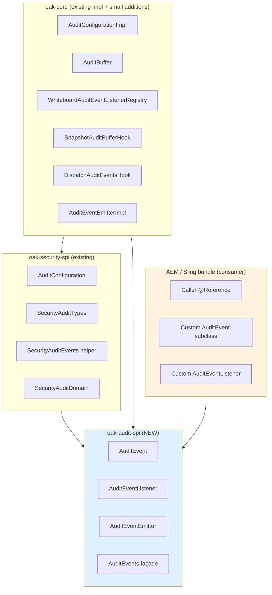

# Cross-Stack Audit — Design

This is the canonical design spec for the audit-event SPI shipping in `oak-audit-spi` and its consumers (`oak-security-spi`, `oak-core`). The producer surface is open to any OSGi bundle in the stack — Oak, AEM, Sling, third-party — and the listener interface is a single method.

An earlier internal design round narrowed the bridge to commit-attached-only; that approach was reverted before implementation in favor of the open producer surface here, accepting the trust-model trade-off documented in §9.

**Layered framing — event primitives vs. pipeline ownership.** The event primitives (`AuditEvent`, `AuditEventListener`, `AuditEventEmitter`) and the static `AuditEvents` façade are domain-neutral at the type level — any bundle can construct an event for any domain string. The **pipeline wiring** in v1 is, however, security-bound: `AuditConfiguration extends SecurityConfiguration`, the pipeline contributes hooks via `SecurityConfiguration.getCommitHooks(...)`, and `AuditConfigurationImpl` lives in `oak.security.audit`. A v1-vetoed design (`docs/history/design-item-2-v1-vetoed.md`) attempted to elevate audit to a top-level Oak service with a new `CommitHookProvider` SPI in `oak-store-spi`; user constraints invalidated that direction. The current design (item 2 v2, `docs/design-item-2.md`) addresses the original "marker interface" complaint by enriching `AuditConfiguration` with a real semantic method (`isActive()`) while keeping the v1 security-bound pipeline ownership intact. The split (neutral primitives, security-bound pipeline) is the design.

---

## 1. Goals & non-goals

### Goals

- One dispatch place for ALL audit events regardless of origin.
- Higher-stack code (AEM, Sling, third-party bundles) can issue events for their own domains, on their own schedule, without committing through Oak.
- Trivial AEM call site: `@Reference AuditEventEmitter` + `emit(event)`.
- Coexists with the existing Path α commit-attached security audit pipeline.
- No compile-time coupling between consumer bundles and `oak-security-spi`.

### Non-goals

- Spoofing prevention at the SPI level. Any bundle can emit any domain. The trust model is documented (§9), not enforced by the type system or runtime gates.
- Reserved domains.
- Commit-boundary semantics on the producer side.
- Outbound forwarding to OSGi EventAdmin or AEM AuditLog. Deferred; listeners can fan out themselves if needed.
- `getOriginBundle()` on AuditEvent. Explicitly excluded; per-source attribution is the consumer's responsibility (via payload conventions).

---

## 2. Architecture overview

Two producer paths feed a single listener registry. Both paths converge on one listener method.

```mermaid
flowchart LR
    subgraph PROD["Producers"]
        OAK_CAP["Oak internal capture<br>(UserManagerImpl etc.)"]
        AEM_CAP["AEM / Sling / 3rd-party<br>any bundle, any time"]
    end

    subgraph FACADE["oak-audit-spi · AuditEvents (static)"]
        REC["record(root, event)"]
        DISP["dispatch(event)"]
    end

    subgraph PATH_CA["Commit-attached path (oak-core, existing)"]
        BUF["ThreadLocal AuditBuffer"]
        VAL["Validators"]
        DRAIN["DispatchAuditEventsHook<br>(decorate payload + drain)"]
    end

    EMIT["AuditEventEmitterImpl<br>(oak-core, OSGi @Component)"]

    REG["WhiteboardAuditEventListenerRegistry"]

    subgraph LISTENERS["Listeners (consumer bundles)"]
        L1["SiemForwarder<br>onEvents(events)"]
        L2["ComplianceArchive<br>onEvents(events)"]
    end

    OAK_CAP --> REC
    REC --> BUF
    BUF --> VAL
    VAL -->|merge ok| DRAIN
    DRAIN --> REG

    AEM_CAP -->|"@Reference emit"| EMIT
    EMIT --> DISP
    DISP --> REG

    REG -->|filter by domain<br>sort by rank| L1
    REG --> L2

    style PROD fill:#fff4e0
    style EMIT fill:#e0ffe0
    style LISTENERS fill:#f0e0ff
```



**Invariant:** there is ONE registry, ONE listener method. The two paths differ only in:
- whether events are buffered (commit-attached) or dispatched immediately (fire-and-forget)
- whether the event payload carries commit metadata keys (set by the drain hook on commit success)

---

## 3. Module layout

`oak-audit-spi` is a NEW module extracted from the current Path α additions to `oak-security-spi`. It holds the domain-neutral audit primitives. `oak-security-spi` keeps its security-specific event subclasses and now depends on `oak-audit-spi`.



| Module | Status | Role |
|---|---|---|
| `oak-audit-spi` | NEW | Domain-neutral SPI: `AuditEvent` (with static factory `of(domain, type, payload)`), `AuditEventListener`, `AuditEventEmitter`, `AuditEvents` static façade |
| `oak-security-spi` | existing — depends on `oak-audit-spi` | Security domain constants (`SecurityAuditDomain`, `SecurityAuditTypes` with type-string + payload-key constants), `SecurityAuditEvents` helper class for ergonomic security-domain capture sites, `AuditConfiguration` security configuration interface (with `isActive()` pipeline-state probe) |
| `oak-core` | existing — adds `AuditEventEmitterImpl` + `AuditConfigurationImpl` | Pipeline implementation (registry, buffer, hooks, emitter, configuration) |
| AEM / Sling / 3rd-party | consumer | Maven dep on `oak-audit-spi` only |

**Consumer compile classpath:** `oak-audit-spi`. Nothing else from Oak. No `oak-core`, no `oak-jcr`, no `oak-security-spi`.

### 3.1 Per-domain helper convention

Item 3 removed the per-event typed subclass hierarchy from `oak-security-spi` (the deleted classes were `SecurityAuditEvent`, `MemberAddedEvent`, `MemberRemovedEvent`, `MembersAddedBulkEvent`, `MembersRemovedBulkEvent`). The reviewer's "vocabulary leak" and "class proliferation" objections are now addressed by:

- One public construction entry point on the domain-neutral SPI: `AuditEvent.of(domain, type, payload)`.
- Per-domain helpers in the **owning module** (not in `oak-audit-spi`), exposing the bare `AuditEvent` interface — consumers cannot `instanceof`-check helper outputs, so the helper is purely a call-site ergonomic.

In `oak-security-spi` the helper is `SecurityAuditEvents` (e.g. `.memberAdded(groupPath, memberPath)`, `.membersAddedBulk(...)`). The convention is informal in v1; future audit-event consumers in Oak's security stack (ACL, principal, token, login) MAY follow the same pattern, providing their own per-domain helper class in the relevant security subpackage. Codify the convention in `oak-audit-spi`'s package Javadoc when a second domain implements such a helper.

### 3.2 Item 2 v2 — `AuditConfiguration` enrichment

The "marker interface" complaint raised against Path α (`AuditConfiguration` shipped only `NAME` + `NOOP` + the implicit `extends SecurityConfiguration`) is addressed by adding one real semantic method:

```java
boolean isActive();
```

`AuditConfigurationImpl.isActive()` delegates to `AuditEvents.isEnabled()` — single source of truth for the predicate (the body lives in `BufferSink.isEnabled()` exclusively). The `Noop` inner class returns `false`. The drift-prevention invariant is documented on both the interface method's Javadoc and the impl's Javadoc.

The v2 SPI delta is exactly one abstract method on `AuditConfiguration`. No `MutableRoot` changes, no `Oak.with(...)` additions, no `oak-store-spi` additions, no package renames. The v1-vetoed approach is preserved in `docs/history/design-item-2-v1-vetoed.md` for design history; full v2 spec in `docs/design-item-2.md`.

### 3.2a Feature toggle name — deferred OAK rename

`AuditConfigurationImpl.FEATURE_TOGGLE_NAME` is currently `"FT_AUDIT"`. The convention in `AGENTS.md` requires `FT_<DESCRIPTION>_OAK-<issue>` for upstream toggles. The rename to `"FT_AUDIT_OAK-<NNNNN>"` is **deferred to a future follow-up** — the upstream OAK JIRA ticket has not been filed yet, and the user (who is away) is the right person to file it. The constant deliberately **does not** appear on the public `AuditConfiguration` SPI interface in v2: putting the literal on the SPI would commit consumers to the exact value forever, making the OAK-suffix rename a breaking change rather than the additive shift it is today. When the ticket is filed, the constant updates to its OAK-suffixed value and can ALSO move to the SPI interface as a binary-additive change. The source Javadoc at `AuditConfigurationImpl:73-78` records this rationale inline so future maintainers don't move the constant prematurely.

### 3.2b Pre-existing JMM observation — follow-up

`AuditConfigurationImpl`'s `featureToggle`, `buffer`, and `registry` fields are plain (non-volatile) instance fields. The `getCommitHooks(workspaceName)` method reads them on commit threads while the OSGi `@Activate` / `@Deactivate` paths write them on a different thread. The path works in practice because OSGi DS provides happens-before from `@Activate` to subsequent service uses, and the long publication chain (`SecurityProviderBuilder` → `ContentRepositoryImpl` → `ContentSessionImpl` → `MutableRoot.commit`) carries the visibility forward via `InternalSecurityProvider.auditConfiguration` being `volatile`.

Formally, `volatile` on these three fields would make the visibility explicit and remove the OSGi-runtime dependency. **Out of scope for v2** (item 2). Filed here so the observation doesn't drop off the radar — a future PR can add the three `volatile` keywords with minimal risk. The v2 delegating `isActive()` doesn't add to this concern: reads go through the existing volatile `AuditEvents.sink`, sidestepping the impl-field publication entirely.

---

## 4. SPI surface

### 4.1 `AuditEvent` — unchanged from Path α

```java
@ProviderType
public interface AuditEvent {
    @NotNull String getDomain();
    @NotNull String getType();
    long getTimestamp();
    @NotNull Map<String, Object> getPayload();
}
```

No `getOriginBundle()`. No `getCommitContext()`. Source-specific metadata lives in the payload Map.

### 4.2 `AuditEventListener` — single method (Option C)

```java
@ConsumerType
public interface AuditEventListener {

    /**
     * Returns the domain this listener subscribes to. Listeners are
     * domain-scoped: only events whose {@link AuditEvent#getDomain()} matches
     * are delivered.
     */
    @NotNull
    String getDomain();

    /**
     * Returns the dispatch rank. Higher rank invoked first. Default 0.
     */
    default int getRank() {
        return 0;
    }

    /**
     * Invoked when one or more events for this listener's domain are
     * dispatched. Events arrive in capture order. Implementations must be
     * non-blocking; expensive work belongs in an async wrapper.
     *
     * <p><strong>Trust model.</strong> Events delivered through this method
     * may originate from either:
     * <ul>
     *   <li>Oak-internal capture sites tied to a successful {@code Root.commit()}.
     *       Such events carry {@code commit.sessionId}, {@code commit.userId},
     *       and {@code commit.timestamp} entries in their payload.</li>
     *   <li>Any bundle calling {@link AuditEventEmitter#emit(AuditEvent)}.
     *       The accuracy of such events is the emitting bundle's responsibility;
     *       Oak does not verify them. They do not carry the {@code commit.*}
     *       payload entries.</li>
     * </ul>
     * Consumers that need to distinguish should inspect payload keys.
     *
     * @param events non-empty list of events for this listener's domain
     */
    void onEvents(@NotNull List<AuditEvent> events);
}
```

**Single method.** No `NodeState`, no `CommitInfo` parameters. Commit-attached events carry `commit.*` payload keys; fire-and-forget events don't.

### 4.3 `AuditEventEmitter` — NEW OSGi service

```java
@ProviderType
public interface AuditEventEmitter {

    /**
     * Dispatches the event synchronously on the calling thread to all
     * listeners registered for the event's domain. Not tied to any commit;
     * not buffered; not rolled back on failure.
     *
     * <p>Listeners are invoked under per-listener try/catch isolation: one
     * listener throwing does not prevent others from running, and exceptions
     * are logged but never propagate back to the caller.
     *
     * @param event the event to dispatch, non-null
     */
    void emit(@NotNull AuditEvent event);

    /**
     * Returns true when at least one listener is registered for the given
     * domain. Callers should gate event allocation with this method on hot
     * paths to avoid unnecessary work when audit is off.
     *
     * @param domain the domain to check, non-null
     */
    boolean isEnabledFor(@NotNull String domain);
}
```

Consumed via `@Reference`. One singleton per OSGi container, owned by `oak-core`.

### 4.4 `AuditEvents` façade — extended

```java
public final class AuditEvents {

    public interface Sink {
        boolean isEnabled();
        boolean isEnabledFor(@NotNull String domain);

        /** Existing — commit-attached buffering path. */
        void record(@NotNull Root root, @NotNull AuditEvent event);

        /** NEW — fire-and-forget dispatch path. */
        void dispatch(@NotNull AuditEvent event);
    }

    private static volatile Sink sink = NOOP;

    public static void install(Sink newSink) { sink = (newSink != null) ? newSink : NOOP; }

    public static boolean isEnabled()                       { return sink.isEnabled(); }
    public static boolean isEnabledFor(String domain)        { return sink.isEnabledFor(domain); }
    public static void record(Root root, AuditEvent event)   { sink.record(root, event); }

    /** NEW. */
    public static void dispatch(AuditEvent event)            { sink.dispatch(event); }
}
```

---

## 5. Commit-attached pipeline — preserved, payload decorated at drain time

Path α's commit-attached pipeline is unchanged structurally. The only adaptation: at drain time, before `registry.dispatch(events)`, the `DispatchAuditEventsHook` DECORATES each event's payload with commit metadata.

```java
// in DispatchAuditEventsHook.processCommit, after validators pass:
List<AuditEvent> events = drainBuffer(sessionId);
List<AuditEvent> decorated = events.stream()
        .map(e -> withCommitMetadata(e, commitInfo))
        .collect(Collectors.toList());
registry.dispatch(decorated);
```

The `withCommitMetadata` helper wraps the original event, returning a new `AuditEvent` whose `getPayload()` includes:

| Key | Value | Source |
|---|---|---|
| `commit.sessionId` | `commitInfo.getSessionId()` | `CommitInfo` |
| `commit.userId` | `commitInfo.getUserId()` | `CommitInfo` (`OAK_UNKNOWN` for system commits) |
| `commit.timestamp` | `commitInfo.getDate()` | `CommitInfo` |

Everything else in the original payload passes through unchanged. The decorator is internal to `oak-core`; consumers see only the public `AuditEvent` interface.

**`NodeState after` is not surfaced in the payload.** Listeners that need to query post-commit state `@Reference NodeStore` directly.

**`OAK_UNKNOWN` resolution:** listeners MUST NOT attempt to resolve `OAK_UNKNOWN` to a real user. It is a deliberate anonymity marker for system commits. This is captured in the `AuditEventListener.onEvents` Javadoc.

---

## 6. Fire-and-forget pipeline — new

```
AEM bundle: audit.emit(event)
  → AuditEventEmitterImpl.emit(event)                       (oak-core, OSGi singleton)
  → AuditEvents.dispatch(event)                              (oak-audit-spi static façade)
  → sink.dispatch(event)                                     (installed by AuditConfigurationImpl)
  → registry.dispatch(List.of(event))                        (WhiteboardAuditEventListenerRegistry)
  → for each listener with matching domain, ordered by rank:
       listener.onEvents(List.of(event))                     (synchronous on calling thread)
```

**Properties:**
- **No buffer.** The ThreadLocal `AuditBuffer` is bypassed entirely.
- **No commit.** The event fires immediately. Subsequent JCR operations have no bearing on it.
- **Synchronous on calling thread.** Listeners doing I/O must wrap themselves in an async dispatcher (their responsibility). The `AuditEventListener.onEvents` Javadoc states this.
- **Per-listener try/catch isolation.** One listener throwing does not stop the others. Exceptions are logged and swallowed.
- **No payload decoration.** Fire-and-forget events keep the payload the caller provided. They do NOT carry `commit.*` keys.

### 6.1 `AuditEventEmitterImpl` skeleton

```java
package org.apache.jackrabbit.oak.core.audit;

import org.apache.jackrabbit.oak.spi.audit.AuditEvent;
import org.apache.jackrabbit.oak.spi.audit.AuditEventEmitter;
import org.apache.jackrabbit.oak.spi.audit.AuditEvents;
import org.jetbrains.annotations.NotNull;
import org.osgi.service.component.annotations.Component;

@Component(service = AuditEventEmitter.class)
public class AuditEventEmitterImpl implements AuditEventEmitter {

    @Override
    public void emit(@NotNull AuditEvent event) {
        AuditEvents.dispatch(event);
    }

    @Override
    public boolean isEnabledFor(@NotNull String domain) {
        return AuditEvents.isEnabledFor(domain);
    }
}
```

Roughly 15 lines. All work is in the static façade and the listener registry, which are part of `oak-core`'s existing wiring.

---

## 7. End-to-end sequence

```mermaid
sequenceDiagram
    autonumber
    participant OakCap as Oak internal caller<br>(UserManagerImpl)
    participant AemCap as AEM/Sling caller<br>(ContentFragmentAuditor)
    participant AE as AuditEvents façade<br>(oak-audit-spi)
    participant EMIT as AuditEventEmitterImpl<br>(oak-core, OSGi @Component)
    participant AB as AuditBuffer<br>(ThreadLocal per session)
    participant NS as NodeStore.merge
    participant Val as Validators
    participant Disp as DispatchAuditEventsHook
    participant Reg as WhiteboardAuditEventListenerRegistry
    participant L as Listener<br>(SiemForwarder)

    Note over OakCap,L: Commit-attached path (Path α, payload-decorating drain)
    OakCap->>AE: record(root, securityEvent)
    AE->>AB: append(sessionId, event)
    Note over AB: Buffered until commit drain
    OakCap->>NS: Root.commit()
    NS->>Val: validators run
    alt validators pass
        NS->>Disp: processCommit
        Disp->>AB: drain(sessionId)
        Disp->>Disp: decorate payload with<br>commit.sessionId, commit.userId, commit.timestamp
        Disp->>Reg: dispatch(decoratedEvents)
        Reg->>L: onEvents(decoratedEvents)
    else validators fail
        NS--xOakCap: CommitFailedException
        Note over AB: Buffer cleared in finally; events discarded
    end

    Note over OakCap,L: Fire-and-forget path (NEW)
    AemCap->>EMIT: emit(aemEvent)
    EMIT->>AE: dispatch(aemEvent)
    AE->>Reg: registry.dispatch(List.of(aemEvent))
    Reg->>L: onEvents(List.of(aemEvent))

    Note over OakCap,L: Same listener, single onEvents method. Source distinguishable via presence/absence of commit.* payload keys.
```

---

## 8. AEM / Sling caller skeletons

### 8.1 Commit-anchored AEM event (content fragment)

```java
@Component
public class ContentFragmentAuditor {

    @Reference
    private AuditEventEmitter audit;

    public void onFragmentPublished(String path, String variation) {
        if (audit.isEnabledFor("aem.content")) {
            audit.emit(new ContentFragmentPublishedEvent(path, variation));
        }
    }
}

// Defined in the AEM bundle. Implements oak-audit-spi.AuditEvent — no other Oak dep.
class ContentFragmentPublishedEvent implements AuditEvent {
    private final String path;
    private final String variation;
    private final long timestamp = System.currentTimeMillis();

    ContentFragmentPublishedEvent(String path, String variation) {
        this.path = path;
        this.variation = variation;
    }

    @Override public String getDomain()              { return "aem.content"; }
    @Override public String getType()                { return "fragment.published"; }
    @Override public long getTimestamp()             { return timestamp; }
    @Override public Map<String, Object> getPayload() {
        return Map.of("path", path, "variation", variation);
    }
}
```

### 8.2 Non-commit AEM event (workflow lifecycle)

```java
@Component
public class WorkflowAuditor {

    @Reference
    private AuditEventEmitter audit;

    public void onStepCompleted(String workflowId, String stepId, String initiator) {
        // No JCR commit, no Session. Just emit.
        if (audit.isEnabledFor("aem.workflow")) {
            audit.emit(new WorkflowStepCompletedEvent(workflowId, stepId, initiator));
        }
    }
}
```

### 8.3 Listener consuming both pipelines through one method

```java
@Component(service = AuditEventListener.class)
public class SiemForwarder implements AuditEventListener {

    @Override
    public String getDomain() { return "aem.content"; }

    @Override
    public void onEvents(List<AuditEvent> events) {
        for (AuditEvent e : events) {
            Map<String, Object> p = e.getPayload();
            // Commit-attached events carry these keys; fire-and-forget don't.
            String sessionId = (String) p.get("commit.sessionId");
            String userId    = (String) p.get("commit.userId");
            siem.forward(e, sessionId, userId);   // siem.forward handles null values
        }
    }
}
```

A second listener subscribing to `"security"` receives Oak's commit-attached security events through the same method; the `commit.*` keys are populated.

---

## 9. Trust model — explicit statement

The fire-and-forget producer surface is OPEN. This is deliberate.

- **Any bundle that resolves `AuditEventEmitter` can emit any event for any domain**, including `"security"`. There is no compile-time check, no reserved-domain registry, no runtime gate.
- **Listeners receive caller-asserted data.** An event arriving through `onEvents` reflects the emitting bundle's claim, not Oak-verified truth.
- **Consumers must NOT treat the audit trail as authoritative without correlation.** A SIEM that ingests Oak's audit stream and treats every event as Oak-attested is operating against the documented contract.

### 9.1 Why this trade-off

The team explored a stricter design (an internal "Proposal C") with compile-time reserved-domain enforcement, typed `AuditEvent` subclasses, and runtime checks. Proposal C protects against bundle-level forgery at the cost of producer flexibility — particularly: only commit-attached emission, only typed events, no opaque payloads.

The user prioritized flexibility: enable any higher-stack bundle to emit, on its own schedule, for any domain. The trust trade-off is accepted at this level.

### 9.2 Mitigation guidance for downstream consumers

| Need | Approach |
|---|---|
| Distinguish Oak-attested vs caller-asserted | Check payload keys: `commit.sessionId`, `commit.userId`, `commit.timestamp` are present iff the event came from Oak's commit-attached pipeline. |
| Filter out a specific bundle's events | Consumer maintains an allowlist of trusted domains. AEM bundle emits domain `aem.content`; SIEM rule "only trust events with domain starting with `aem.` from bundles X, Y, Z" is the consumer's responsibility. |
| Compliance audit (Oak-verified mutations only) | Consumer subscribes to `security` domain and filters for events with `commit.*` keys populated. |

This is consumer-side discipline. It is NOT enforced by the SPI.

---

## 10. Migration from the earlier in-tree design

An earlier in-tree skeleton used `AuditEventListener.onCommit(NodeState, CommitInfo, List<AuditEvent>)` with security-event types living in `oak-security-spi`. The migration to this design:

1. **Move types** from `oak-security-spi` to a new `oak-audit-spi` module (domain-neutral event primitives):
   - `AuditEvent`
   - `AuditEventListener`
   - `AuditEvents`
   - `AuditBufferLifecycle`

   `AuditConfiguration` is intentionally **NOT** moved — it stays in `oak-security-spi` because it `extends SecurityConfiguration` (pipeline ownership is security-bound in v1; see item 2 v2).
2. **Add to `oak-audit-spi`**:
   - `AuditEventEmitter` OSGi service interface
3. **Modify `AuditEventListener`**:
   - Replace `void onCommit(NodeState, CommitInfo, List<AuditEvent>)` with `void onEvents(List<AuditEvent>)`
   - Update Javadoc with the trust-model section (§4.2 above)
4. **Modify `AuditEvents.Sink`**:
   - Add `void dispatch(AuditEvent event)` method
5. **Modify `AuditEvents` façade**:
   - Add `static void dispatch(AuditEvent event)` method
6. **Modify `DispatchAuditEventsHook`** (oak-core):
   - At drain time, decorate each event's payload with `commit.sessionId`, `commit.userId`, `commit.timestamp` from `CommitInfo` before calling `registry.dispatch(...)`
7. **Add `AuditEventEmitterImpl`** in `oak-core` as `@Component(service = AuditEventEmitter.class)` (skeleton in §6.1).
8. **Keep / add in `oak-security-spi`** (now depending on `oak-audit-spi`):
   - `SecurityAuditDomain` — domain identifier constant for `"security"`.
   - `SecurityAuditTypes` — type-string and payload-key constants (per item 3; supersedes the deleted per-event typed subclasses).
   - `SecurityAuditEvents` — ergonomic helper class providing per-event factory methods that delegate to `AuditEvent.of(...)`.
   - `AuditConfiguration` — security configuration interface, enriched with `isActive()` per item 2 v2.

**Item 3 deletion (post-Path α):** the per-event typed subclasses (`SecurityAuditEvent`, `MemberAddedEvent`, `MemberRemovedEvent`, `MembersAddedBulkEvent`, `MembersRemovedBulkEvent`) were removed; their semantics are now encoded as `domain + type` strings via `SecurityAuditTypes`, with capture-site ergonomics provided by `SecurityAuditEvents`. See `docs/design-item-3.md`.

**Item 2 v2 enrichment (post-Path α):** `AuditConfiguration` gains a `boolean isActive()` method, addressing the reviewer's "marker interface" complaint while preserving the v1 security-bound pipeline wiring. See `docs/design-item-2.md`.

The `MutableRoot` lifecycle hooks for the commit-attached buffer (refresh, rebase, commit-failure) are unchanged. The `WhiteboardAuditEventListenerRegistry` gains the fire-and-forget dispatch path but its filtering/sorting logic is unchanged.

---

## 11. Test strategy outline

Detailed plan to be authored after spec approval. Scope:

| Area | Tests |
|---|---|
| Static façade | `dispatch(event)` routes to installed Sink; NOOP behavior when no Sink |
| `AuditEventEmitterImpl` | OSGi activation registers service; `emit` routes to façade; `isEnabledFor` short-circuits |
| Listener registry — fire-and-forget | Single listener invoked; multiple listeners invoked in rank order; non-matching domain not invoked; per-listener try/catch isolation; null/empty events handled |
| Listener registry — commit-attached | Existing Path α tests adapted to `onEvents` signature |
| Payload decoration | Drain-time decoration adds `commit.sessionId`, `commit.userId`, `commit.timestamp`; preserves original payload entries; works for system commits (`OAK_UNKNOWN` userId) |
| Mixed pipeline | One listener subscribes to `security` and receives both commit-attached events (with `commit.*` keys) and fire-and-forget events from another bundle (without those keys); content of each batch is correct |
| Migration regression | Capture-site tests adapted post item 3 (typed-event removal); `UserManagerImplAuditTest` and `AuditWiringIT` verify that `SecurityAuditEvents.memberAdded(...)`, `.memberRemoved(...)`, `.membersAddedBulk(...)`, `.membersRemovedBulk(...)` flow through the pipeline end-to-end with `domain == SecurityAuditDomain.NAME` and `type == SecurityAuditTypes.USER_MEMBER_ADDED` (etc.) |
| Coverage | `oak-audit-spi` **100% line / 100% branch** (revised UP from 0.99 / 1.0 in item 3; the new code is small enough that 100% is trivial). `oak-security-spi` stays at its standing 100% / 100% gate. `oak-core` audit additions covered as part of the existing `oak-core` test surface (`>80%` per AGENTS.md). |

---

## 12. Deferred items

| Item | Trigger to revisit |
|---|---|
| `LoginModuleMonitor.loginSucceeded` extension + internal `MonitorAuditBridge` | Login audit becomes a concrete requirement |
| Outbound forwarding (OSGi EventAdmin, AEM AuditLog, Sling Jobs) | When a deployment needs cross-bundle pub/sub on the audit stream; listeners can fan out themselves in the interim |
| Reserved domains / spoofing prevention | If the trust trade-off in §9 proves problematic in practice. Would require a separate hardening revision (compile-time check, runtime gate). |
| Async listener wrapper (analog to `BackgroundObserver`) | Reference impl deferred; listeners are responsible for non-blocking behavior in v1. |
| Backpressure / rate limiting on fire-and-forget | Not in v1. Consumers can self-regulate if needed. |

---

## 13. Process note for future SPI iterations

An earlier design cycle for this work round-tripped through several revisions on whether `AuditEvent.getOriginBundle()` belonged in v1 — eventually dropped. Process lesson recorded here for future SPI iterations: dependent work (tests, security review, downstream consumers) should not commit against an in-flight SPI until the design is frozen.

---

## 14. Summary

| Decision | This design |
|---|---|
| Producer surface | OPEN — any bundle can emit any event for any domain |
| Commit boundary on producer side | None — fire-and-forget; commit-attached path preserved for Oak-internal use |
| Listener method | SINGLE: `onEvents(List<AuditEvent>)` |
| Event construction | Static factory `AuditEvent.of(domain, type, payload)`; no typed subclasses on the SPI (item 3) |
| Per-domain ergonomics | Helper classes in owning module — e.g. `SecurityAuditEvents` in `oak-security-spi` (item 3) |
| Pipeline ownership in v1 | **Security-bound** — `AuditConfiguration extends SecurityConfiguration`, wired via `SecurityProviderBuilder.withAuditConfiguration(...)` (item 2 v2; replaces the vetoed option-a "top-level Oak service" design) |
| `AuditConfiguration` interface | Enriched with `boolean isActive()` (item 2 v2); addresses the "marker interface" reviewer complaint while keeping the v1 wiring intact |
| `NodeState` / `CommitInfo` on listener | None — commit metadata embedded in event payload at drain time |
| Module split | NEW `oak-audit-spi` (event primitives are domain-neutral); `oak-security-spi` and `oak-core` depend on it; consumers depend on `oak-audit-spi` only |
| Trust model | Caller-asserted — listeners receive what the emitting bundle says happened |
| Coverage gate | `oak-audit-spi` 100% / 100% (revised up in item 3); `oak-security-spi` 100% / 100%; `oak-core` >80% (general rule) |
| Outbound forwarding | Deferred |
| Login audit | Deferred (LoginModuleMonitor extension is a future option) |
| `FT_AUDIT` → `FT_AUDIT_OAK-<NNNNN>` rename | Deferred — pending upstream OAK ticket allocation by the user; constant stays at `AuditConfigurationImpl`, not on SPI, until the OAK number exists. See §3.2a. |
| `volatile` on impl `featureToggle`/`buffer`/`registry` | Deferred — pre-existing JMM observation, out of scope for item 2 v2. See §3.2b. |

---

End of spec. Implementation plan to follow via the `writing-plans` skill upon user approval.
