# Audit pipeline design

This document specifies the design of Oak's audit pipeline:
- the SPI surface in `oak-core-spi` and the security-domain extensions in `oak-security-spi`,
- the pipeline implementation in `oak-core`,
- OSGi wiring,
- embedded (non-OSGi) wiring,
- threading and ordering invariants,
- the test patterns that pin the contracts.

For a one-page overview suitable for terminal `cat` and PR descriptions, see [`audit-design-overview.md`](audit-design-overview.md). For the user-facing guide (consumers of the SPI), see [`audit.md`](audit.md).

---

## 0. Executive summary

The audit pipeline transports structured `AuditEvent`s from Oak-internal capture sites (and any OSGi bundle resolving `AuditEventEmitter`) to bundle-registered `AuditEventListener` consumers, gated by a feature toggle and a per-domain listener registry.

There are two delivery paths:

- **Commit-attached** — Oak-internal capture sites (e.g. `UserManagerImpl`) call `AuditEvents.record(root, event)`. Events land in a per-session `ThreadLocal` `AuditBuffer`, and a `NodeStore` `Observer` (`AuditDrainObserver`) drains and dispatches them after the surrounding `Root.commit()` durably persists. Events carry `commit.sessionId` / `commit.userId` / `commit.timestamp` payload entries injected by `CommitMetadataDecorator` at drain time; a failed commit drops the buffer.
- **Fire-and-forget** — Any OSGi bundle resolves `AuditEventEmitter` via `@Reference` and calls `emit(event)`. The event is dispatched synchronously on the calling thread; no buffering, no commit boundary, no payload decoration.

Both paths converge on a single dispatch method (`AuditEventListener.onEvents(List<AuditEvent>)`) and share one listener registry. Failure isolation is layered: an OUTER `Throwable` barrier in `AuditDrainObserver.contentChanged` prevents audit from masquerading as a commit failure, and an INNER per-listener `Throwable` barrier on both paths prevents one misbehaving listener from stopping the others.

Pipeline ownership lives in `AuditConfigurationImpl` (`oak-core`), which is registered as an OSGi service of type `AuditConfiguration` (a top-level Oak concern — **not** a `SecurityConfiguration`).

---

## 1. Commit flow

```
MutableRoot.commit()
  → store.merge(builder, getCommitHook(), commitInfo)         [thread T1]
      → ResetCommitAttributeHook
      → SecurityConfiguration hooks
      → EditorHook(validators)
      → durable commit
      → ChangeDispatcher.contentChanged(rootAfter, commitInfo)  [synchronous, same thread T1]
          └─ AuditDrainObserver.contentChanged(root, info)      [drains buffer, decorates, dispatches]
  → returns to MutableRoot
```

The observer fires synchronously on the same thread as the commit, AFTER durable persistence, BEFORE `store.merge` returns. The threading invariant — single-threaded session, `ThreadLocal` buffer keyed by session id — is preserved across the drain.

Confirmed against all four production NodeStore implementations (`Memory`, `Segment`, `Document`, `Composite`): all route through `ChangeDispatcher`, which invokes observers synchronously on the commit thread.

---

## 2. Architecture overview

```mermaid
flowchart LR
    subgraph PROD["Producers"]
        OAK_CAP["Oak internal capture<br>(UserManagerImpl etc.)"]
        AEM_CAP["AEM / Sling / 3rd-party<br>any bundle, any time"]
    end

    subgraph FACADE["oak-core-spi · AuditEvents (static)"]
        REC["record(root, event)"]
        DISP["dispatch(event)"]
    end

    subgraph PATH_CA["Commit-attached path (oak-core)"]
        BUF["ThreadLocal AuditBuffer"]
        VAL["Validators"]
        DURABLE["Durable commit"]
        OBS["AuditDrainObserver<br>(decorate payload + drain)"]
    end

    EMIT["AuditEventEmitterImpl<br>(oak-core, OSGi @Component)"]

    REG["WhiteboardAuditEventListenerRegistry"]

    subgraph LISTENERS["Listeners (consumer bundles)"]
        L1["SiemForwarder<br>onEvents(events)"]
        L2["ComplianceArchive<br>onEvents(events)"]
    end

    OAK_CAP --> REC
    REC --> BUF
    BUF --> VAL
    VAL -->|merge ok| DURABLE
    DURABLE -->|ChangeDispatcher.contentChanged| OBS
    OBS --> REG

    AEM_CAP -->|"@Reference emit"| EMIT
    EMIT --> DISP
    DISP --> REG

    REG -->|filter by domain<br>sort by rank| L1
    REG --> L2

    style PROD fill:#fff4e0
    style EMIT fill:#e0ffe0
    style LISTENERS fill:#f0e0ff
    style OBS fill:#e0e0ff
```



The commit-attached path flows `OAK_CAP → REC → BUF → VAL → DURABLE → OBS → REG`; the fire-and-forget path flows `AEM_CAP → EMIT → DISP → REG`. Both paths share `REG` (the listener registry) and dispatch via the same `onEvents` method on each registered listener.

---

## 3. SPI layout

### 3.1 `oak-core-spi`

`oak-core-spi` is the domain-neutral audit SPI. It defines the event primitives (`AuditEvent`, `AuditEventListener`, `AuditEventEmitter`, the static `AuditEvents` façade, `AuditBufferLifecycle`) and the `AuditConfiguration` typed handle on the pipeline's runtime state. Package: `org.apache.jackrabbit.oak.spi.audit`.

The `AuditConfiguration` interface:

```java
package org.apache.jackrabbit.oak.spi.audit;

import org.jetbrains.annotations.NotNull;
import org.osgi.annotation.versioning.ProviderType;

/**
 * Audit pipeline configuration handle. Exposes pipeline-level state
 * ({@link #isActive()}) so admin tooling, monitoring agents, and other
 * Oak components can probe the pipeline without depending on its
 * implementation class.
 *
 * <p><strong>Wiring.</strong> Audit is a top-level Oak concern — <em>not</em>
 * a {@code SecurityConfiguration}. Implementations are registered on the
 * {@link org.apache.jackrabbit.oak.spi.whiteboard.Whiteboard} (and, in OSGi
 * deployments, as an OSGi service of this type). The pipeline subscribes to
 * the root NodeStore's {@link org.apache.jackrabbit.oak.spi.commit.Observable}
 * for commit notifications; it contributes no commit hooks.
 *
 * <p><strong>Cardinality:</strong> unary optional. Multiple implementations
 * are not supported — the {@link AuditBufferLifecycle} is a singleton install
 * and multiple observers on the same root NodeStore would each produce a
 * duplicate dispatch. Multiplexing belongs at the listener layer
 * ({@link AuditEventListener}), not at the configuration layer.
 *
 * <p>When no implementation is bound, callers either see no service
 * (Whiteboard / OSGi lookups return empty) or the {@link #NOOP} constant
 * if they want a guaranteed-non-null handle. {@code NOOP.isActive()}
 * returns {@code false}.
 */
@ProviderType
public interface AuditConfiguration {

    /**
     * Returns {@code true} when the audit pipeline is currently active —
     * i.e., the audit feature toggle is enabled AND at least one
     * {@code AuditEventListener} is registered on the Whiteboard. The
     * two predicates AND together so a deployed-but-unused pipeline still
     * reports {@code false}, matching the no-allocation semantics
     * documented at {@link AuditEvents#isEnabled()}.
     *
     * <p>Equivalent in semantics to {@code AuditEvents.isEnabled()}, but
     * reachable via the typed handle. Drift-prevention: both paths read
     * through the volatile {@code AuditEvents.sink} (single source of
     * truth). Any future divergence MUST be documented explicitly in
     * both Javadocs.
     */
    boolean isActive();

    /**
     * NOOP default. Reports {@link #isActive()} as {@code false}.
     */
    AuditConfiguration NOOP = new Noop();

    /**
     * NOOP implementation. Package-private by design — consumers refer
     * to the {@link #NOOP} constant.
     */
    final class Noop implements AuditConfiguration {

        @Override
        public boolean isActive() {
            return false;
        }
    }
}
```

### 3.2 `oak-security-spi` — security-domain constants

`oak-security-spi/.../spi/security/audit/SecurityAuditDomain` holds the single domain string `"oak.security"` shared by all events Oak's security stack emits (user management, ACLs, principals, tokens, etc.). The `oak.` prefix namespaces the domain so listeners hosted in mixed environments (Sling, AEM, third-party bundles) can disambiguate Oak's security events from same-named domains defined by other layers.

Per-sub-domain type-string vocabulary lives alongside the SPI it describes. Today only user-membership events ship:

- `oak-security-spi/.../spi/security/user/UserAuditTypes` — type strings (`USER_MEMBER_ADDED`, `USER_MEMBERS_ADDED_BULK`, etc.) and payload keys (`PAYLOAD_GROUP_PATH`, `PAYLOAD_MEMBER_IDS`, etc.). Listener bundles compile-time-reference these to discriminate user events.

Future ACL / principal / token events declare their own per-sub-domain `*AuditTypes` classes in the respective SPI sub-packages.

Producer-side factories (the helpers that capture sites call to build a typed event) are deliberately **not** part of the SPI. They live as package-private classes alongside their only callers — e.g., `oak-core/.../security/user/UserAuditEvents` next to `UserManagerImpl`. The asymmetric exposure (read-side vocabulary in SPI, write-side factories impl-private) is documented on `UserAuditTypes` as defense-in-depth; it raises the bar for casual forging of Oak-attested events but is not a hard boundary — any bundle can still call `AuditEvent.of(domain, type, payload)` directly. Listeners that need to distinguish Oak-attested commit-attached events from fire-and-forget emissions MUST check for the `commit.*` keys in the payload (see §0 trust contract).

### 3.3 Package-info versions

- `oak-core-spi/.../spi/audit/package-info.java` — `@Version("1.0.0")`. Fresh package within `oak-core-spi`.
- `oak-security-spi/.../spi/security/audit/package-info.java` — `@Version("2.0.0")`. Now contains only `SecurityAuditDomain` and `package-info.java`.
- `oak-security-spi/.../spi/security/user/package-info.java` — `@Version("2.10.0")`. Minor-bump for the additive `UserAuditTypes` class.

---

## 4. Implementation

### 4.1 `AuditDrainObserver` — new class

Lives at `oak-core/src/main/java/org/apache/jackrabbit/oak/security/audit/AuditDrainObserver.java`. Package question (kept in `security.audit` for minimum churn, or moved to a neutral `oak.audit`) is **open for team-lead decision** — see §13 below.

```java
package org.apache.jackrabbit.oak.security.audit;

import java.util.ArrayList;
import java.util.HashMap;
import java.util.List;
import java.util.Map;

import org.apache.jackrabbit.oak.spi.audit.AuditEvent;
import org.apache.jackrabbit.oak.spi.audit.AuditEventListener;
import org.apache.jackrabbit.oak.spi.commit.CommitInfo;
import org.apache.jackrabbit.oak.spi.commit.Observer;
import org.apache.jackrabbit.oak.spi.state.NodeState;
import org.apache.jackrabbit.oak.spi.toggle.Feature;
import org.jetbrains.annotations.NotNull;
import org.slf4j.Logger;
import org.slf4j.LoggerFactory;

/**
 * {@link Observer} that drains the {@link AuditBuffer} on commit success
 * and dispatches captured events to all registered {@link AuditEventListener}s.
 * <p>
 * The observer fires synchronously on the same thread as the
 * surrounding {@code MutableRoot.commit()} — by the contract of
 * {@link org.apache.jackrabbit.oak.spi.commit.Observable#addObserver}
 * the call is made from the commit dispatch path, before
 * {@code NodeStore.merge(...)} returns. This preserves the
 * {@code ThreadLocal} semantics that the {@link AuditBuffer} relies on.
 * <p>
 * <strong>External changes are ignored.</strong> When
 * {@link CommitInfo#isExternal()} returns {@code true} (cluster sync from
 * a peer node, or the initial replay invocation at {@code addObserver()}
 * time with {@link CommitInfo#EMPTY_EXTERNAL}), the observer returns
 * immediately. External commits did not originate any local
 * {@code AuditEvents.record(...)} calls, so there is nothing in the
 * per-session buffer to drain. Explicit short-circuit; cleaner than
 * relying on the buffer to return empty.
 * <p>
 * <strong>Two-layer exception isolation:</strong>
 * <ul>
 *   <li><strong>Outer barrier</strong> wraps the ENTIRE method body. The
 *   Observer chain has no per-observer isolation
 *   ({@code CompositeObserver.java:46-53} — bare {@code for} loop with no
 *   try/catch). Any throw out of this method propagates through
 *   {@code DocumentNodeStore.java:1140-1144} (in a {@code finally} after
 *   {@code setRoot}) or {@code LockBasedScheduler.java:303} (after
 *   {@code head.set}), surfacing as a {@code RuntimeException} to the
 *   merge caller despite a successful durable commit. Worse, on
 *   DocumentNodeStore the inner catch at {@code DocumentNodeStore:1130-1139}
 *   suppresses in-memory commit-apply failures, so an audit-induced throw
 *   would mask a different kind of failure entirely. The outer Throwable
 *   barrier guarantees audit never masquerades as a commit failure.</li>
 *   <li><strong>Inner barrier</strong> per listener (in {@code dispatchOne}).
 *   A misconfigured consumer bundle whose listener throws
 *   {@link LinkageError}, {@link OutOfMemoryError}, or other
 *   {@link Throwable} subtypes does not stop other listeners.</li>
 * </ul>
 *
 * <p><strong>DO NOT wrap this Observer in {@code BackgroundObserver}.</strong>
 * The async wrapper drops the {@code CommitInfo.sessionId} on queue overflow
 * (it replaces the latest queued entry with
 * {@code new ContentChange(root, CommitInfo.EMPTY_EXTERNAL)} —
 * {@code BackgroundObserver.java:283-286}). The audit drain keys exclusively
 * on {@code info.getSessionId()} to look up the per-thread buffer;
 * losing session id on overflow → silent audit-event loss for
 * high-rate writers. Synchronous dispatch is mandatory. See §9 invariant I4.
 */
final class AuditDrainObserver implements Observer {

    private static final Logger log = LoggerFactory.getLogger(AuditDrainObserver.class);

    private final Feature featureToggle;
    private final AuditBuffer buffer;
    private final WhiteboardAuditEventListenerRegistry registry;

    AuditDrainObserver(@NotNull Feature featureToggle,
                       @NotNull AuditBuffer buffer,
                       @NotNull WhiteboardAuditEventListenerRegistry registry) {
        this.featureToggle = featureToggle;
        this.buffer = buffer;
        this.registry = registry;
    }

    @Override
    public void contentChanged(@NotNull NodeState root, @NotNull CommitInfo info) {
        // OUTER Throwable barrier. CompositeObserver
        // (oak-store-spi/.../spi/commit/CompositeObserver.java:46-53) does NOT
        // isolate per-observer exceptions: a Throwable from this method
        // cascades through the observer chain and would break peer observers
        // such as JCR's observation dispatcher. We swallow defensively so the
        // audit pipeline can never destabilise unrelated observer work. The
        // per-listener barrier inside dispatchOne catches listener-induced
        // failures; this outer catch protects against drain/decorator bugs.
        try {
            doContentChanged(info);
        } catch (Throwable t) {
            log.warn("AuditDrainObserver: unexpected error during drain/dispatch (session {}); " +
                    "swallowing to preserve observer-chain isolation.",
                    info.getSessionId(), t);
        }
    }

    private void doContentChanged(@NotNull CommitInfo info) {
        // External commits never produce local audit events (capture sites
        // are local-only by construction). The bootstrap invocation at
        // addObserver-time with CommitInfo.EMPTY_EXTERNAL also lands here.
        if (info.isExternal()) {
            return;
        }
        if (!featureToggle.isEnabled()) {
            return;
        }
        String sessionId = info.getSessionId();
        // The buffer is per-thread; this drain runs on the same thread that
        // called Root.commit() (synchronous Observer contract via
        // ChangeDispatcher for local commits). The sessionId returned by
        // CommitInfo equals ContentSession.toString() — set at
        // MutableRoot.java:262 — so it matches the buffer's keying.
        List<AuditEvent> events = buffer.drain(sessionId);
        if (events == null || events.isEmpty()) {
            return;
        }
        List<AuditEventListener> listeners = registry.getListeners();
        if (listeners.isEmpty()) {
            return;
        }
        List<AuditEvent> decorated = CommitMetadataDecorator.decorate(events, info);
        Map<String, List<AuditEvent>> byDomain = groupByDomain(decorated);
        for (AuditEventListener listener : listeners) {
            List<AuditEvent> forListener = byDomain.get(listener.getDomain());
            if (forListener == null || forListener.isEmpty()) {
                continue;
            }
            dispatchOne(listener, forListener);
        }
    }

    private static @NotNull Map<String, List<AuditEvent>> groupByDomain(@NotNull List<AuditEvent> events) {
        Map<String, List<AuditEvent>> byDomain = new HashMap<>(4);
        for (AuditEvent event : events) {
            byDomain.computeIfAbsent(event.getDomain(), k -> new ArrayList<>(events.size())).add(event);
        }
        return byDomain;
    }

    private static void dispatchOne(@NotNull AuditEventListener listener,
                                    @NotNull List<AuditEvent> events) {
        try {
            listener.onEvents(events);
        } catch (Throwable t) {
            // Per-listener isolation: a misconfigured consumer bundle whose listener
            // throws e.g. LinkageError must not crash the commit-dispatch path for
            // unrelated work. JVM-level pathology (OutOfMemoryError) is caught here
            // too but re-triggers on the next allocation and surfaces through normal
            // channels. Do not narrow this catch to RuntimeException without
            // re-reading the design discussion in §0 (executive summary).
            log.warn("AuditEventListener {} threw {} for {} event(s) in domain '{}'; isolating from other listeners.",
                    listener.getClass().getName(), t.getClass().getSimpleName(),
                    events.size(), listener.getDomain(), t);
        }
    }
}
```

**Notable choices:**

- **No `CommitContext` involvement.** The observer drains the buffer directly. Events never enter `CommitContext` — which is a shared string-keyed channel observable to any `CommitHook` running in the same commit, so keeping audit events out of it eliminates a class of cross-bundle information disclosure.
- **Two-layer `Throwable` catch.** The outer barrier (this method) and the inner barrier (per-listener in `dispatchOne`) catch every `Throwable` subtype including `Error`. A misconfigured consumer bundle cannot crash the dispatch loop or the surrounding commit.
- **Same decorator call.** `CommitMetadataDecorator.decorate(events, info)` is invoked here; the decorator class body is unchanged. Sage's invariant #2 preserved.
- **No `throws CommitFailedException`.** Observer's contract is `void contentChanged(NodeState, CommitInfo)` — no checked exceptions. Listener exceptions are swallowed via the per-listener Throwable catch (inner barrier); drain/decorator bugs are swallowed via the outer barrier in `contentChanged`. Both barriers exist because `CompositeObserver` does not isolate observers (shannon confirmed). We never throw.

- **No `@Component` on AuditDrainObserver.** This class is a plain Java type, instantiated and registered by `AuditConfigurationImpl` (see §5.2). The OSGi-visible service is registered via `BundleContext.registerService(Observer.class.getName(), ...)`, matching the Lucene `LocalIndexObserver` idiom (`LuceneIndexProviderService.java:617-618`). Oak's `ObserverTracker` (in `oak-store-spi/.../spi/commit/ObserverTracker.java`, instantiated per NodeStoreService — `DocumentNodeStoreService.java:481`, `SegmentNodeStoreRegistrar.java:388`, `CompositeNodeStoreService.java:187`) picks up the `Observer` service and subscribes it to the root NodeStore.

### 4.2 `AuditConfigurationImpl` — restructured

Lives at `oak-core/src/main/java/org/apache/jackrabbit/oak/security/audit/AuditConfigurationImpl.java`. Key properties:

1. Does **not** extend `ConfigurationBase` and does **not** implement `SecurityConfiguration`.
2. Registered as `@Component(service = AuditConfiguration.class)` only.
3. **No `@Reference Observable observable;`** — instead, follows Oak's existing Observer-registration idiom (`LuceneIndexProviderService.java:617-618`): the OSGi `@Activate` registers the drain observer as an `Observer` service on the `BundleContext`, and Oak's `ObserverTracker` (instantiated per NodeStoreService — `DocumentNodeStoreService.java:481`, `SegmentNodeStoreRegistrar.java:388`, `CompositeNodeStoreService.java:187`) picks it up and subscribes it to the root NodeStore.
4. Holds a `private ServiceRegistration<?> observerRegistration;` field so `@Deactivate` can unregister.
5. Contributes no commit hooks — drain is observer-based.
6. `BufferSink` (inner class) is the `Sink` for `AuditEvents` and backs the capture-time enqueue path.

8. **OSGi `@Activate` (the new shape):**

```java
@Activate
private void activate(@NotNull Configuration configuration,
                      @NotNull BundleContext bundleContext,
                      @NotNull Map<String, Object> properties) {
    setParameters(ConfigurationParameters.of(properties));   // if we still extend something that needs it; else remove
    Whiteboard whiteboard = new OsgiWhiteboard(bundleContext);
    initialize(whiteboard);
    // After initialize() the buffer + registry + toggle + sink + drainObserver are
    // all live. Register the observer service LAST so any commit thread that races
    // with activation either misses the observer entirely (no harm — events stay
    // buffered for next commit) or sees a fully-wired pipeline.
    observerRegistration = bundleContext.registerService(
            Observer.class.getName(), getDrainObserver(), null);
}
```

8. **Embedded (non-OSGi) `initialize(Whiteboard)`:** the drain observer is constructed ONCE inside `initialize(...)`, cached as a field, and exposed via a singleton getter. A factory-style `getDrainObserver()` (returning a new instance per call) would have been a foot-gun because the `ThreadLocal` lives on `AuditBuffer`, not on the Observer; two Observer instances sharing the same buffer would create double-dispatch under any non-destructive drain refactor.

```java
// Field — alongside featureToggle / buffer / registry
private AuditDrainObserver drainObserver;

public void initialize(@NotNull Whiteboard whiteboard) {
    featureToggle = Feature.newFeature(FEATURE_TOGGLE_NAME, whiteboard);

    registry = new WhiteboardAuditEventListenerRegistry();
    registry.start(whiteboard);

    buffer = new AuditBuffer();
    AuditBufferLifecycle.install(buffer);

    AuditEvents.install(new BufferSink(featureToggle, registry, buffer));

    // Construct ONCE. Cached for re-use by both OSGi @Activate (which
    // publishes it as an Observer service) and embedded callers (which
    // pass it to Oak.with(Observer)).
    drainObserver = new AuditDrainObserver(featureToggle, buffer, registry);

    log.info("Audit pipeline activated. Toggle '{}' = {}.",
            FEATURE_TOGGLE_NAME, featureToggle.isEnabled());
}

/**
 * Returns the singleton {@link Observer} for this pipeline. Embedded
 * callers attach it to the root NodeStore explicitly via
 * {@code ((Observable) store).addObserver(audit.getDrainObserver())} and
 * hold the returned {@link Closeable} for tear-down. The
 * {@code Oak.with(Observer)} auto-attach path at {@code Oak.java:300-302}
 * only fires for Oak's DEFAULT whiteboard; embedded test setups that share
 * a Whiteboard between audit and Oak (the common case) replace that default
 * via {@code Oak.with(Whiteboard)} and lose the auto-attach. See §6 of this
 * document for the full embedded pattern.
 *
 * <p><strong>Singleton by design.</strong> The drain Observer is constructed
 * once in {@link #initialize(Whiteboard)} and reused; multi-attach
 * (two Observer instances against the same root NodeStore) would create
 * race-prone double-dispatch under any future drain refactor that drops the
 * destructive-by-default semantic. Mirrors how {@link BufferSink} is
 * installed once into {@link AuditEvents}.
 *
 * @throws IllegalStateException if called before {@link #initialize(Whiteboard)}
 *                               or after {@link #dispose()}.
 */
public @NotNull Observer getDrainObserver() {
    if (drainObserver == null) {
        throw new IllegalStateException(
                "AuditConfigurationImpl.initialize(...) must be called first");
    }
    return drainObserver;
}
```

The `getDrainObserver()` method exposes the singleton. OSGi `@Activate` passes it to `bundleContext.registerService(Observer.class.getName(), getDrainObserver(), null)` — `ObserverTracker` (per NodeStoreService) then auto-attaches it to the root NodeStore. Embedded callers attach explicitly via `((Observable) store).addObserver(getDrainObserver())` because Oak's `Oak.with(Observer)` auto-attach is bypassed once `Oak.with(Whiteboard)` replaces the default whiteboard (see §6). Both paths converge at the same `Observable.addObserver(...)` call against the same Observer instance.

10. **OSGi `@Deactivate`:**

```java
@Deactivate
private void deactivate() {
    // Unregister the observer service FIRST. ObserverTracker, on noticing the
    // service disappear, closes its subscription on the root NodeStore — so
    // no further contentChanged calls reach our buffer / registry while we
    // tear them down.
    if (observerRegistration != null) {
        try {
            observerRegistration.unregister();
        } catch (RuntimeException e) {
            log.warn("Audit deactivate: observerRegistration.unregister() failed; continuing.", e);
        } finally {
            observerRegistration = null;
        }
    }
    dispose();
}
```

`dispose()` has two preconditions worth calling out: (a) `observerRegistration` MUST be `null` at entry — i.e. the OSGi service has been unregistered before internals are torn down. This converts misuse (calling `dispose()` directly after `@Activate` without going through `@Deactivate`) into a loud failure rather than a silent leak. (b) The cached `drainObserver` field is zeroed at the end, so a post-dispose `getDrainObserver()` throws `IllegalStateException` mirroring the pre-initialize behaviour. The observer-subscription unregister lives in `@Deactivate`'s wrapping logic.

```java
public void dispose() {
    // NEW — precondition: caller MUST have unregistered the observer service
    // first (the OSGi @Deactivate wrapper does this automatically). Calling
    // dispose() while observerRegistration is still live would leave a
    // dangling Observer subscription pointing at torn-down state — a silent
    // leak that the outer Throwable barrier in §4.1 would mask. Fail loud
    // instead.
    Validate.checkState(observerRegistration == null,
            "AuditConfigurationImpl.dispose() called while observer service is still registered; unregister first");

    // ... close toggle / stop registry / install-null façades / clearAll buffer ...

    drainObserver = null;   // NEW — singleton zeroed alongside the rest
}
```

The precondition is a no-op for non-OSGi callers (they never assign `observerRegistration`, so the check passes trivially). For OSGi callers, the `@Deactivate` wrapper unregisters and nulls `observerRegistration` BEFORE calling `dispose()` (§5.3 step 0 → step 1), so the check also passes. Misuse — calling `dispose()` directly in OSGi without going through `@Deactivate` — is the case the check refuses.

For non-OSGi callers, the Observer is attached explicitly via `((Observable) store).addObserver(audit.getDrainObserver())` (the `Oak.with(Observer)` path's auto-attach only fires for Oak's default whiteboard, which the common shared-whiteboard test setup replaces). The returned `Closeable` is the test/fixture's responsibility to close BEFORE calling `dispose()`. See §6 for the full embedded pattern.

### 4.3 Files DELETED

- `oak-core/src/main/java/org/apache/jackrabbit/oak/security/audit/SnapshotAuditBufferHook.java`
- `oak-core/src/main/java/org/apache/jackrabbit/oak/security/audit/DispatchAuditEventsHook.java`
- `oak-core/src/test/java/org/apache/jackrabbit/oak/security/audit/SnapshotAuditBufferHookTest.java` (if it exists; if not, no-op)
- `oak-core/src/test/java/org/apache/jackrabbit/oak/security/audit/DispatchAuditEventsHookTest.java` (if it exists)
- `oak-security-spi/src/main/java/org/apache/jackrabbit/oak/spi/security/audit/AuditConfiguration.java`
- `oak-security-spi/src/test/java/org/apache/jackrabbit/oak/spi/security/audit/AuditConfigurationTest.java`

### 4.4 Files MODIFIED

- `oak-core/src/main/java/org/apache/jackrabbit/oak/security/audit/AuditConfigurationImpl.java` — described in §4.2.
- `oak-core/src/main/java/org/apache/jackrabbit/oak/security/internal/SecurityProviderBuilder.java` — remove `withAuditConfiguration` method and any `audit` field. `initialize(whiteboard)` paths that previously delegated audit setup to SecurityProviderBuilder are decoupled.
- `oak-core/src/main/java/org/apache/jackrabbit/oak/security/internal/InternalSecurityProvider.java` — has no `auditConfiguration` field, no `setAuditConfiguration` setter, no audit entry in `getConfigurations()`. Audit is wired independently of the `SecurityProvider` graph.
- `oak-core/src/main/java/org/apache/jackrabbit/oak/security/internal/SecurityProviderRegistration.java` — remove the `@Reference(name = "auditConfiguration", ...)` block.
- `oak-run-commons/src/main/java/org/apache/jackrabbit/oak/run/MemoryNSWithAuditFixture.java` (or wherever `OakFixture.getMemoryNSWithAudit` lives) — switch from `SecurityProviderBuilder.withAuditConfiguration(...)` to `audit.initialize(whiteboard)` followed by `((Observable) store).addObserver(audit.getDrainObserver())` per §6, holding the returned `Closeable` for tear-down. Confirm path with turing (she added the fixture in `39605eacb1`).

### 4.5 Files UNCHANGED (substance)

- All of `oak-core-spi/src/main/java/org/apache/jackrabbit/oak/spi/audit/*.java` except the NEW `AuditConfiguration.java`.
- `oak-core/src/main/java/org/apache/jackrabbit/oak/security/audit/CommitMetadataDecorator.java`.
- `oak-core/src/main/java/org/apache/jackrabbit/oak/security/audit/AuditBuffer.java`.
- `oak-core/src/main/java/org/apache/jackrabbit/oak/security/audit/AuditEventEmitterImpl.java`.
- `oak-core/src/main/java/org/apache/jackrabbit/oak/security/audit/WhiteboardAuditEventListenerRegistry.java`.
- `oak-core/src/main/java/org/apache/jackrabbit/oak/core/MutableRoot.java` — the audit lifecycle callouts in `refresh()` and the `commit()` failure path STAY (they cover paths the observer doesn't see). The `rebase()` callout was REMOVED: rebase preserves transient changes, so the audit events staged alongside them must survive too and be dispatched on the eventual commit (rebase review fix).

---

## 5. OSGi wiring

### 5.1 Component declaration

```java
@Component(service = AuditConfiguration.class)
@Designate(ocd = AuditConfigurationImpl.Configuration.class)
public class AuditConfigurationImpl implements AuditConfiguration {

    // Internal pipeline state — see §4.2.
    private Feature featureToggle;
    private AuditBuffer buffer;
    private WhiteboardAuditEventListenerRegistry registry;

    // Observer service registration — holds the OSGi handle so @Deactivate
    // can unregister and let ObserverTracker close its subscription.
    private ServiceRegistration<?> observerRegistration;

    // ... @Activate / @Deactivate / initialize / getDrainObserver / dispose per §4.2
}
```

There is **NO** `@Reference Observable` or `@Reference NodeStore`. The wiring follows Oak's existing Observer-registration idiom (`LuceneIndexProviderService.java:617-618`): the component registers an `Observer` service on the `BundleContext`, and Oak's `ObserverTracker` (in `oak-store-spi/.../spi/commit/ObserverTracker.java`, instantiated per NodeStoreService — `DocumentNodeStoreService.java:481`, `SegmentNodeStoreRegistrar.java:388`, `CompositeNodeStoreService.java:187`) tracks `Observer` services and registers them on the root NodeStore via `Observable.addObserver(...)`.

**Why this idiom (not `@Reference Observable`):**
- It's the actual Oak precedent (Lucene's `LocalIndexObserver`, the JCR observation dispatcher, and `Oak.java:300-302` for the embedded equivalent).
- No direct coupling between AuditConfigurationImpl and NodeStore.
- ObserverTracker handles the `Observable` cast + selection of the correct root NodeStore — we don't reinvent the wiring.
- Composite-NodeStore selection is solved by ObserverTracker (which receives the same NodeStore the rest of `oak-jcr` uses); we don't have to write OSGi service-filter logic.

### 5.2 Activation sequence

```
SCR activates AuditConfigurationImpl
  → @Activate calls private activate(bundleContext, ...)
  → activate calls initialize(OsgiWhiteboard(bundleContext))
  → initialize does:
      1. featureToggle = Feature.newFeature(...)
      2. registry.start(whiteboard)
      3. AuditBufferLifecycle.install(buffer)
      4. AuditEvents.install(bufferSink)
  → activate then:
      5. observerRegistration = bundleContext.registerService(
             Observer.class.getName(),
             new AuditDrainObserver(featureToggle, buffer, registry),
             null)
  → ObserverTracker (started by the active NodeStoreService — e.g. DocumentNodeStoreService:481) notices the new Observer
    service and subscribes it to the root NodeStore via Observable.addObserver
  → addObserver immediately invokes contentChanged(root, CommitInfo.EMPTY_EXTERNAL)
  → AuditDrainObserver: isExternal() == true → returns (no-op)
```

Step 5 is LAST so any concurrent commit thread that races with activation either misses the observer (step 5 hasn't completed registration; observer not yet subscribed by ObserverTracker; events stay buffered until next commit drain) or sees a fully-wired pipeline (steps 1-4 done before step 5).

### 5.3 Deactivation sequence

```
SCR deactivates AuditConfigurationImpl
  → @Deactivate calls private deactivate()
  → deactivate does:
      0. observerRegistration.unregister()
         [ObserverTracker notices Observer service disappear → closes its
          subscription on the root NodeStore → no further contentChanged
          calls reach our AuditDrainObserver]
      → deactivate then calls dispose():
      1. featureToggle.close()
      2. registry.stop()
      3. AuditEvents.install(null)
      4. AuditBufferLifecycle.install(null)
      5. buffer.clearAll()
```

Step 0 is FIRST so that no further `contentChanged(...)` calls reach the buffer/registry while we're tearing them down. ObserverTracker.removedService closes the subscription returned by `Observable.addObserver` immediately, so a commit thread that starts AFTER step 0 will never see the observer. A commit thread that's mid-way through `contentChanged` when step 0 runs will continue with the about-to-be-torn-down state — but each individual `contentChanged` call is short and completes before step 1 begins (and even if it didn't, the outer Throwable catch at §4.1 ensures any tear-down-induced NPE is swallowed without affecting peer observers).

The outer `Throwable` catch in `contentChanged` makes this defensive: even if `dispose()` zeroes a field while a `contentChanged` is mid-flight, the resulting NPE is swallowed without affecting peer observers in the chain.

**Precedent for the "detach first, internals second" ordering:** `oak-jcr/.../observation/ChangeProcessor.java:289-295` follows the same pattern — `filteringObserver.close()` (detach) precedes `executor.stop()` (internals tear-down). The audit pipeline mirrors this canonical Oak shape.

---

## 6. Embedded (non-OSGi) wiring

Embedded callers (tests, `OakFixture.getMemoryNSWithAudit`, custom Oak embeds) wire the pipeline explicitly via `((Observable) store).addObserver(...)`:

```java
// Embedded test / fixture setup
MemoryNodeStore store = new MemoryNodeStore();              // implements Observable
DefaultWhiteboard whiteboard = new DefaultWhiteboard();

AuditConfigurationImpl audit = new AuditConfigurationImpl();
audit.initialize(whiteboard);                                // wires toggle/registry/buffer/sink

// Explicit observer attachment. Embedded callers that share a Whiteboard
// instance between audit and Oak (which is the common case — we want listener
// registrations on the same whiteboard the audit registry tracks) MUST attach
// the observer to the NodeStore directly. The `Oak.with(Observer)` path's
// auto-attach (Oak.java:300-302) only fires for Oak's DEFAULT whiteboard;
// `Oak.with(Whiteboard)` at Oak.java:562-563 replaces the default with a
// plain DefaultWhiteboard that has no auto-attach. So the safe path is
// always direct addObserver. See "Why the explicit addObserver" below.
Closeable observerHandle = ((Observable) store).addObserver(audit.getDrainObserver());

ContentRepository repo = new Oak(store)
        .with(securityProvider)
        .with(whiteboard)
        .createContentRepository();

// Register listeners on the whiteboard
whiteboard.register(AuditEventListener.class, new MyListener(), Map.of());

// ... drive commits via repo ...

// tear-down — close in reverse
observerHandle.close();   // detach observer first (mirrors §5.3 dispose-order)
repo.close();
audit.dispose();
```

### Why the explicit addObserver (not `Oak.with(Observer)`)

Oak's DEFAULT whiteboard is an anonymous override at `Oak.java:276-302` whose `register(Observer.class, ...)` method has a side-effect that calls `((Observable) store).addObserver(observer)` at line 300-302. That auto-attach is what would let `Oak.with(Observer)` "just work" — but only for the default whiteboard.

The moment an embedder calls `Oak.with(Whiteboard)` (Oak.java:562-563), the default whiteboard is replaced with whatever the embedder passed — typically a plain `DefaultWhiteboard` with no auto-attach side effect. From that point, `Oak.with(Observer)` at Oak.java:598 still registers the Observer as a service on the (replaced) whiteboard, but nothing tracks that registration to call `Observable.addObserver`. The drain never fires.

Sharing a whiteboard between audit and Oak is the COMMON case for embedded tests/fixtures (we want `AuditEventListener` registrations and the audit listener tracker on the same whiteboard). So in practice, `Oak.with(Observer)` is the wrong path for embedded wiring — direct `((Observable) store).addObserver(...)` is the right path.

### OSGi production is unaffected

The OSGi flow (`bundleContext.registerService(Observer.class.getName(), drainObserver, null)`) does NOT depend on Oak.java:300-302's auto-attach. It publishes to the OSGi service registry, which the per-NodeStoreService `ObserverTracker` (`DocumentNodeStoreService.java:481`, `SegmentNodeStoreRegistrar.java:388`, `CompositeNodeStoreService.java:187`) tracks independently. The OSGi path was always going to work; only the embedded path required the explicit addObserver.

### Relationship with `SecurityProviderBuilder`

`SecurityProviderBuilder` exposes setters for the six `SecurityConfiguration` participants (Authentication, Authorization, User, Privilege, Principal, Token). It does **not** expose any audit-related setter — audit is owned by `AuditConfigurationImpl` and wired separately, as described above.

---

## 7. MutableRoot lifecycle callouts

`MutableRoot` has three audit lifecycle callouts:

- **`rebase()` / `refresh()`** → `AuditBufferLifecycle.onRefresh(sessionId)`. These paths discard pending transient changes — any audit events captured for the session that haven't yet been merged must be dropped. The observer is NOT invoked for a `refresh`/`rebase` (no `merge` happened), so the lifecycle callout is the only thing that drains the buffer.
- **`commit()` finally → `if (!merged)`** → `AuditBufferLifecycle.onCommitFailed(sessionId)`. If `store.merge(...)` threw, the observer was never invoked (or the merge failure prevented it from reaching contentChanged dispatch). The lifecycle callout drains the buffer to prevent leaking events from a failed commit into a subsequent successful one on the same session.

**All three callouts ALWAYS fire — they are not gated by `AuditEvents.isEnabled()`.** When no `AuditConfigurationImpl` is installed the `AuditBufferLifecycle` listener is the NOOP singleton, so each callout is one volatile read of the `AuditBufferLifecycle.listener` field plus one virtual dispatch into the NOOP — no allocation, no work. `rebase` / `refresh` issue the `onRefresh` callout unconditionally; `commit` always runs inside a `try { ... } finally { if (!merged) onCommitFailed(...); }` so a failed merge always drains the buffer.

> **Why ALWAYS, not gated.** An earlier iteration gated each callout on `AuditEvents.isEnabled()` to skip the virtual dispatch when no listener is registered. That introduced a real race: capture with the gate=ON, toggle flips OFF, a subsequent gated lifecycle path skipped its destructive `drain(sessionId)`, and stale events from the capture survived to be dispatched against a later (toggle=ON) commit with that commit's `commit.*` metadata — corrupting audit integrity. The current always-fire shape closes the regression. The NOOP cost in the no-audit-module case (one volatile read + one NOOP virtual call per callout) is negligible vs. surrounding work.

These three callouts cover EXACTLY the cases the observer doesn't see. With the observer in place for the successful-commit path, the responsibility split is:

| Case | Who drains the buffer? |
|---|---|
| `Root.commit()` succeeds (merge returns normally) | `AuditDrainObserver.contentChanged` (observer fires synchronously) |
| `Root.commit()` fails (merge throws) | `MutableRoot.commit` finally block → `AuditBufferLifecycle.onCommitFailed` |
| `Root.refresh()` or `Root.rebase()` | `MutableRoot.refresh/rebase` → `AuditBufferLifecycle.onRefresh` |
| OSGi `@Deactivate` while session is mid-flight | `AuditConfigurationImpl.dispose` step 5 → `buffer.clearAll()` (current-thread only; residual leak bounded by worker-pool × in-flight sessions) |

No new MutableRoot callouts. No new lifecycle states. Confirmed.

---

## 8. Migration commits (oak-upgrade etc.)

`oak-upgrade` and similar migration tools call `NodeStore.merge(...)` directly, bypassing `MutableRoot`. Migration constructs its own commit-hook chain and doesn't go through the `AuditEvents.record(...)` capture path.

**Out-of-OSGi migration** (the common case): `RepositoryUpgrade.java:412` and `RepositorySidegrade.java:437` never construct `AuditConfigurationImpl`. No instance → no Observer registered → migration commits fire no observer, buffer drain never runs.

**In-OSGi migration** (less common, e.g., running oak-run inside a live container with audit deployed):
- The observer IS subscribed to the root NodeStore. If `oak-upgrade` calls `nodeStore.merge(...)`, the observer fires.
- `buffer.drain(info.getSessionId())` runs. The buffer is empty for that session id (no capture path was invoked).
- Observer returns early (events list is null/empty).

**Sage's robustness assumption.** This depends on a precondition: **capture sites are reached only from MutableRoot-driven JCR operations.** If a future migration tool calls `AuditEvents.record(root, event)` directly on a non-MutableRoot `Root`, ghost events could leak. Documented in `AuditEvents.record` Javadoc: "Caller must ensure `root` is the `MutableRoot` of an active JCR session; non-JCR commits MUST NOT call this method." Grep `AuditEvents\.record(` confirms the only current Oak-internal caller is `UserManagerImpl` (always MutableRoot-driven). Safe today.

If a future requirement says "migration mutations should be audited", that's a separate capture-site change — the migration tool would need to call `AuditEvents.record(...)` from inside a `MutableRoot`-equivalent context. It's not a pipeline-design concern.

To enforce intended behavior: AuditPipelineIT gains a "migration-path no-op" assertion that drives a direct `nodeStore.merge(...)` without going through MutableRoot, asserts that listeners receive no events.

---

## 9. Threading + ordering invariants

The design hinges on three invariants:

| Invariant | Source | Status |
|---|---|---|
| **I1: Observer fires synchronously on the commit thread for local commits.** | ChangeDispatcher Javadoc lines 53-55: "Changes are reported synchronously and clients need to ensure to no block any length of time". | **CONFIRMED by shannon (#10).** Memory/Segment/Document/Composite all route through `ChangeDispatcher.contentChanged` synchronously on the merge thread. |
| **I2: Observer fires AFTER durable commit (or not at all if merge throws).** | Observer Javadoc + NodeStore.merge contract. | **CONFIRMED by shannon (#10).** Every successful `NodeStore.merge` fires observers; failed merges do not. |
| **I3: External commits short-circuit at observer entry (defense in depth).** | The `if (info.isExternal()) return;` at observer entry is the AUTHORITATIVE gate. By construction the buffer is empty for external commits (no local capture sites fired), so the gate is redundant in production — but the explicit short-circuit covers FOUR distinct cases with one predicate: (a) the synthetic `addObserver` bootstrap invocation (`ChangeDispatcher.java:65`); (b) cluster replication (`DocumentNodeStore.java:2544`); (c) segment external head movement (`LockBasedScheduler.java:239-247`); (d) COW/Composite/Branch transitive via ChangeDispatcher. A future capture site that mistakenly captures during a session whose CommitInfo ends up external would still be filtered. | **CONFIRMED by shannon (#10) and sage (#12).** |
| **I4: Session-id matches buffer key.** | `CommitInfo.sessionId == ContentSession.toString()` at `MutableRoot.java:262`. The buffer is keyed by `ContentSession.toString()` (see `AuditConfigurationImpl.BufferSink.record` line 298: `buffer.record(root.getContentSession().toString(), event)`). | **CONFIRMED by shannon (#10).** Cite-site verified. |
| **I5: CompositeObserver does NOT isolate per-observer exceptions.** | `oak-store-spi/.../spi/commit/CompositeObserver.java:46-53` — bare loop calling `observer.contentChanged(root, info)` with no try/catch. A throwing observer cascades to break the observer chain. | **CONFIRMED by shannon (#10).** Triggers the outer Throwable barrier in §4.1's `contentChanged`. |
| **I6: No ordering guarantee among observers.** | CompositeObserver uses a `Set` (IdentityHashSet); iteration order is undefined. | **CONFIRMED by shannon (#10).** We don't depend on order; audit dispatches to listeners within its own observer call, and that ordering is determined by `AuditEventListener.getRank()` (registry sorts). |
| **I7: AuditDrainObserver MUST NOT be wrapped in `BackgroundObserver`.** | `BackgroundObserver.java:283-286` — on queue overflow, the implementation replaces the latest queued `ContentChange` with `new ContentChange(root, CommitInfo.EMPTY_EXTERNAL)`. The audit drain keys exclusively on `CommitInfo.getSessionId()` to find the per-thread buffer; losing session id on overflow → silent audit-event loss under load. Plus: ThreadLocal buffer can ONLY be drained on the thread that captured. | **MANDATORY.** Enforced by NOT registering a BackgroundObserver — the synchronous-on-merge-thread dispatch is the canonical path. Class-level Javadoc on `AuditDrainObserver` carries the inline warning so future maintainers don't async-wrap for throughput. |
| **I8: Outer Throwable barrier in `AuditDrainObserver.contentChanged`.** | NodeStore impls (`DocumentNodeStore.java:1140-1144` finally-after-setRoot, `LockBasedScheduler.java:303` after head.set, `MemoryNodeStore.java:100-102` inline loop) all dispatch observers AFTER the commit becomes durable. A throw out of our `contentChanged` surfaces as a fake commit-failure RuntimeException to the merge caller despite successful persistence. On DocumentNodeStore, the inner catch at `:1130-1139` suppresses in-memory failures, so an audit-induced throw could MASK a different kind of failure entirely. | **MANDATORY.** The outer `try { doContentChanged(info); } catch (Throwable t) { log.warn(...); }` in §4.1 is the only line of defense — `CompositeObserver.java:46-53` is a bare loop with no isolation. Do NOT narrow to RuntimeException. |
| **I9: MutableRoot lifecycle callouts always fire — no gate-hoist on `rebase` / `refresh` / `commit`.** | An earlier iteration gated each callout on `AuditEvents.isEnabled()` to skip the virtual dispatch in the no-listener case. Doing so introduced a toggle-flicker race: capture with the gate=ON, toggle flips OFF, the gated lifecycle path skipped its destructive `drain(sessionId)`, and stale events survived to be dispatched against a later (toggle=ON) commit with that commit's `commit.*` metadata — corrupting audit integrity. See §7 "Why ALWAYS, not gated". | **MANDATORY.** NOOP `AuditBufferLifecycle.listener` absorbs the no-audit-module case at one volatile read + one NOOP virtual call per callout — negligible vs. surrounding work. Do NOT re-introduce a gate on the callouts. |

All nine invariants confirmed. Design is locked on this foundation.

---

## 10. Test rewiring

| Test | Change |
|---|---|
| `AuditPipelineIT` | Rewire from "two hooks fire" to "observer fires on commit success". Add a "migration-path no-op" assertion (direct `NodeStore.merge` produces no listener invocations). Add a "commit failure → no dispatch + buffer cleared" assertion. Add a "refresh/rebase → no dispatch + buffer cleared" assertion (these tests likely already exist; verify). |
| `AuditWiringIT` | Verify the full UserManagerImpl → buffer → observer → listener flow. The CapturedEvent → CommitInfo metadata equality check (introduced in `c65a3999b5`) is unchanged. |
| `MemoryNSWithAuditFixtureTest` (turing's `39605eacb1`) | Switch from `SecurityProviderBuilder.withAuditConfiguration(...)` to `audit.initialize(whiteboard)` followed by `((Observable) store).addObserver(audit.getDrainObserver())` per §6, with the returned `Closeable` held by the fixture for tear-down. |
| `SecurityProviderBuilderTest` | Drop the `withAuditConfiguration` test cases (method is removed). |
| `SecurityProviderRegistrationTest` | The expected `getConfigurations()` count is 6 (Authentication, Authorization, User, Privilege, Principal, Token). Audit is NOT in this list — it's published as `AuditConfiguration`, not as a `SecurityConfiguration`. |
| `AuditConfigurationImplTest` | New tests: (a) `@Activate` registers the `Observer` service via `bundleContext.registerService(Observer.class.getName(), ...)`; (b) `@Deactivate` unregisters it; (c) `getDrainObserver()` returns a non-null Observer post-`initialize`; (d) `getDrainObserver()` returns the SAME instance on repeat calls (singleton invariant — guards against accidental factory revert); (e) `getDrainObserver()` throws `IllegalStateException` pre-`initialize`; (f) `getDrainObserver()` throws `IllegalStateException` post-`dispose`; (g) `dispose()` throws `IllegalStateException` when called with `observerRegistration` still non-null (defense-in-depth check — simulate via OSGi-misuse setup that calls `dispose()` without first running `@Deactivate`). |
| `AuditDrainObserverTest` (NEW) | Direct unit tests on the AuditDrainObserver class: (a) `isExternal()` short-circuit returns no-op; (b) toggle-off short-circuit; (c) empty-buffer no-op; (d) groupByDomain correctness; (e) per-listener `dispatchOne` Throwable isolation; (f) **OUTER Throwable barrier**: mock `buffer.drain` or a poisoned `AuditEvent` to throw, verify `contentChanged` returns normally and logs WARN; (g) multi-listener-multi-domain dispatch; (h) OAK_UNKNOWN sessionId no-op (optional, per shannon's defense-in-depth gate). |
| `AuditConfigurationTest` (oak-security-spi) | **MOVED, not deleted**, to `oak-core-spi/src/test/java/org/apache/jackrabbit/oak/spi/audit/AuditConfigurationTest.java`. Preserves institutional knowledge embedded in existing assertions (NAME constant, NOOP.isActive() = false, NOOP non-null). Per sage's invariant #4 caveat. |
| OSGi-deactivation race test (NEW) | Verify that `observerRegistration.unregister()` runs FIRST in `@Deactivate` and that no `contentChanged` invocation happens after it returns (per alex's §5.3 review). Mock `ServiceRegistration` and a `MemoryNodeStore`-Observable; commit on a separate thread mid-deactivate, assert observer is detached before `dispose()` proceeds. |

Coverage gates:
- `oak-core-spi`: 100% line / 100% branch (preserves design.md §11). The NEW `AuditConfiguration.Noop.isActive()` body needs one line of test coverage.
- `oak-core` audit subpackage: covered by named tests per AGENTS.md's >80% rule. The new `AuditDrainObserver` should be fully covered.
- `oak-security-spi`: 100% line / 100% branch UNCHANGED. We're REMOVING the AuditConfiguration interface from this module — no new gate concerns. The remaining audit-domain file in `spi/security/audit/` — `SecurityAuditDomain` — keeps its existing coverage. (Post-freeze cleanup: `SecurityAuditEvents` was deleted; `SecurityAuditTypes` was renamed to `UserAuditTypes` and moved to `spi/security/user/`, where it is covered alongside the rest of the user SPI. See §3.2.)

---

## 11. Design properties

- **Audit is a top-level Oak concern, not a `SecurityConfiguration`.** Pipeline ownership lives in `AuditConfigurationImpl` (`oak-core`), published as an OSGi service of type `AuditConfiguration` (in `oak-core-spi`). `SecurityProvider.getConfiguration(AuditConfiguration.class)` is **not** a valid lookup path; consumers `@Reference AuditConfiguration` directly or resolve via the `Whiteboard`.

- **Events never enter `CommitContext`.** `CommitContext` is a shared string-keyed channel observable to any `CommitHook` running in the same commit. Keeping audit events out of it eliminates a class of cross-bundle information disclosure.

- **Dispatch fires AFTER durable commit.** The `AuditDrainObserver` runs in the post-merge dispatch chain via `ChangeDispatcher`. A successful dispatch implies the corresponding write durably persisted; a failed durable commit never produces an audit event.

- **Observer-chain isolation is explicit.** Both the OUTER `Throwable` barrier in `AuditDrainObserver.contentChanged` and the INNER per-listener `Throwable` barrier are documented contracts pinned by tests. Audit cannot masquerade as a commit failure; one misbehaving listener cannot stop the others.

- **Composite-NodeStore double-dispatch is implicitly deduped.** When `CompositeNodeStore` is the root, the audit Observer can be subscribed via both the composite's own `ObserverTracker` and (potentially) the global store's tracker. Two `contentChanged` invocations per merge — the first drains the destructive `ThreadLocal`, the second finds an empty buffer and no-ops via the `events == null || events.isEmpty()` short-circuit at §4.1. This is pre-existing Oak observer-dispatch behaviour shared with `NonDefaultMountWriteReportingObserver` (`oak-store-composite/.../impl/NonDefaultMountWriteReportingObserver.java:63`); no audit-specific cost beyond what the same dispatch path incurs for any other observer.

- **Migration commits produce no audit events.** `RepositoryUpgrade.java:412` / `RepositorySidegrade.java:437` never construct an `AuditConfigurationImpl`, so no Observer is registered and no events are captured. If a future requirement says "migration mutations should be audited", that's a separate capture-site change (the migration tool would need to call `AuditEvents.record(...)` from inside a `MutableRoot`-equivalent context).

---

## 12. Trade-offs

- **Audit state is not reachable via `SecurityProvider`.** Consumers must `@Reference AuditConfiguration` directly or resolve via the `Whiteboard`. Justified by the fact that audit is genuinely orthogonal to authentication/authorization/principals/users; coupling it to `SecurityConfiguration` was a category error.

- **Migration commits fire the observer but produce no events.** Cost: one `info.isExternal()` check plus one `buffer.drain` (which hits an empty `ThreadLocal` map) per migration commit. Sub-microsecond. Acceptable in exchange for not having a separate "audit-bypass" wiring path for migration tools.

- **`AuditDrainObserver` must not be wrapped in `BackgroundObserver`.** `BackgroundObserver` drops `CommitInfo.sessionId` on queue overflow, which would silently lose audit events under load. The contract is documented on the class and enforced by the OSGi wiring (the observer is registered directly, not via `BackgroundObserver`).
